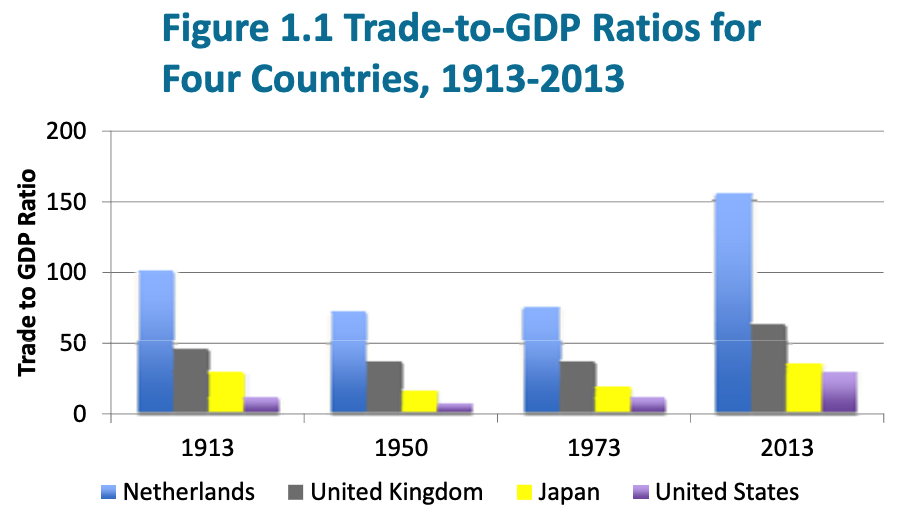

# Introduction to the World Economy

## Learn Objectives

1. Discuss historical measures of international with data on trade, capital flows and migration
2. Compute the trade-to-GDP ratio and explain its significance

## Elements of International Economic Integration

- Globalization has many components, including culture, language, economics, politics and more.
- Globalization in the economic sphere is also called international economic integration.
- International economic integration has occurred rapidly since approximately 1950, but especially since the early 1970s.
- The current wave of international economic integration is not the first.
- A major wave of globalization occurred between approximately 1870 and 1913.
- This earlier wave was destroyed by World War I and II and the worldwide Great Depression of the 1930s
- Economists measure the degree of  international integration by looking at 
  - World trade
  - International capital flows
  - International migration `人口移动`
  - Convergence`趋同` of prices in different markets

## The Growth of World Trade

- Since the end of World War II in 1945, world trade has grown much faster than world production. In 1950, world trade equaled about 5.5 percent of world gross domestic product (GDP). In 1913, world trade was about 30 percent of world GDP.

- Economists measure the ==importance of world trade== with the ==trade‐to‐GDP ratio==. Trade‐to‐GDP ratio is exports plus imports divided by GDP:

  **Trade‐to‐GDP ratio = (exports + imports) ÷GDP**

  The ratio does not tell us much about a country’s trade policies or openness to trade.

The trade‐to‐GDP ratio fell between 1913 and 1950, but has risen since then.
Each country shows the same pattern over time

## International Migration of Labor

- Capital and labor movements across international boundaries are part of international economic integration.
- International migration was larger, relative to population, before World War I than it is today.
- Before World War I, most countries did not require passports and visas, and there were few border controls.
- In 1900, about 14.5 percent of the U.S. population was immigrants. Today, it is around 13 percent
- Migration has increased since the 1960s, but immigrants as a percentage of the total population is less than it was in 1900

## International Capital Flows

There are many types of capital flows:

- Financial flows representing ==paper assets== such as stocks and bonds.
- Capital flows that are used to purchase ==real assets== such as real estate or to set up businesses and factories.
  - The purchase of real assets is know as foreign direct investment (FDI).

Technological improvements facilitate increased capital flows.

Capital flows today:

- Are much larger than during the earlier wave of globalization
- Include many more types of financial instruments
- Are frequently devoted to protecting against currency fluctuations
- Have lower transaction costs than in previous eras

Capital flows are savings of one country that are invested in another

High savings countries tend to have high investment and low savings implies low investment.

- Capital flows are not completely integrated
- Countries cannot completely depend on others for their investment funds

## Three Features of Contemporary International Economic Relations

1. More deep ==integration==, moving beyond shallow`浅` integration.
2. The presence of ==multilateral`多边` organizations== such as the World Trade Organization (WTO)
3. The growth of ==regional trade agreements==, such as the European Union or the North American Free Trade Agreement.

### Shallow integration & Deep intergration

**Shallow integration** consists of the removal of **tariffs** (taxes on imports) and **quotas**`限额` (physical limits on import quantities).

- As tariffs and quotas come down, other policies begin to limit trade

  - Environmental policies

  - Labor policies

  - Safety standards, etc

**Deep integration** occurs when countries try to **reform domestic policies** that limit trade.

- Deep integration is much more controversial`有争议`.

### Multilateral organizations

Multilateral organizations are open to all countries

They are new since World War II. Prominent examples include:

- United Nations;
- International Monetary Fund;
- World Bank;
- World Trade Organization

Multilateral organizations ==reduce uncertainty== in international economic relations. They:

- Mediate`调解` disputes;
- Are forums for setting rules;
- Propose solutions to problems;
- Provide technical and financial assistance

Multilateral organizations are controversial; we look at them more closely in the next chapter

### Regional trade agreements

**Regional trade agreements** (RTAs) are composed of countries that give special market access to each other.
Examples include the North American Free Trade Agreement (NAFTA) and the European Union (EU), among many others.
RTAs have dramatically grown in number since the 1980s.

RTAs are controversial among economists.

- Some economists think they hurt world trade by focusing a country’s attention on just a few trade partners.
- Others believe they help world trade by loosening some barriers and trying out new agreements

## Trade and Economic Growth

Economists favor more open trade because it enables countries to grow faster and its people live better.

Evidence comes in three forms:

- Historical examples of countries.
- Statistical comparisons of countries.
- Economic models and deductive reasoning.

As we will see, trade benefits a nation but not necessarily every individual in the nation

# Tutorial

1. How can globalization and international economic integration be measured?

   - Trade flows

   - Factor movements

   - Convergence of prices

2. What does the trade-to-GDP ratio measure? Does a low value indicate that a country is closed to trade with the outside world?

   - Trade to GDP Ratio: a measure of the relative importance of trade to a national economy. It is measured by the ratio of exports plus imports to GDP
   - No. E.g. The US has a large domestic market that enables its firms/companies to produce large volume to an optima scale without having to sell to foreign markets.

3. Trade and capital flows were described and measured in relative rather than absolute terms. Explain the difference. Which term seems more valid - *relative or absolute?* Why?

   - Absolute values are the dollar amounts of trade and capital flows; whereas relative values are the ratio of dollar amounts but to GDP.
   - Relative values are better indicator of the importace of trade and capital flows since they are proportional the size of national economies. 

4. What are the new issues in international trade and investment? In what sense do they expose national economies to outside influences?

   - New issues: policy differences b/n nations such as labour standards, environmental standards, copetition,anti-trust policies and industrial support policies; 
   - Negotiations between nations potentially give foreign interests a voice in setting domestic policy which is perceived by foreigners a barrier to trade.