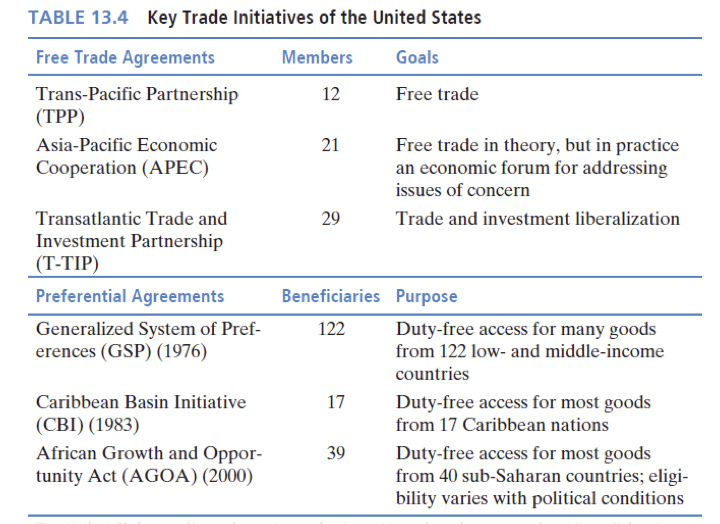

# Chapter 13 The United States in the World Economy

## Learning Objectives

13.1 Identify major changes in U.S. economic relations that have led to bilateral and plurilateral agreements.

13.2 Evaluate the relative importance of the North American Free Trade Agreement, both for it accomplished and as a model for subsequent agreements.

13.3 Explain when purchasing power parity estimates of income per person are superior to the alternatives, and when they are inferior.

13.4 State the reasons whey Mexico and Canada sought free trade with the United States.

13.5 Differentiate free trade agreements from preferential trade agreements and give examples of each.

13.6 State whey it is difficult to have precise estimates of job gains and losses due to trade, and give specific examples of how imports may create jobs and exports may occur after a loss of jobs.

## Introduction: Changing World Economy

- For several decades after World War II, the world economy was bipolar.
  - Two economic systems:  capitalism and communism.
  - Two military superpowers: The United States and the Soviet Union.
- Since the late 1970s, a number of changes have reshaped international economic relations:
  - The economic success of China, followed by India;
  - The rise of emerging markets as active players in the world economy;
  - The break-up of the Soviet Union;
- These forces and others are reshaping the role of the United States in the global economy.

## Background and Context

- Due to its size, world trade is a lower share of the U.S. economy than in most other high income countries.
  - The trade-to-GDP ratio was less than 10 percent in the 1960s but climbed to 30 percent by the 2010s.
- The main trading partners have been relatively constant, with the exception of China.
  - China is \#1 for imports, \#3 for exports.
  - NAFTA partners Canada and Mexico are \#2 and \#3 for imports and \#1 and \#2 for exports.
- Composition of trade has changed:
  - Services have grown from 20 percent in 1980 to 30 percent today.
  - Merchandise goods are the other 70 percent of exports.
    - The U.S. is second largest exporter of merchandise goods, after China;
    - Manufactures are over 50 percent of all exports.

- Recent U.S. trade strategy has ==downgraded the priority of multilateral negotiations== and upgraded bilateral and plurilateral negotiations.
  - The WTO has become too cumbersome due to the large number of countries that participate;
  - As quotas disappeared and tariffs were reduced, more contentious`争议` issues have arisen.
    - Agricultural subsidies;
    - Intellectual property rights;
    - Trade in services;
    - Government procurement;
    - Labor standards, etc.
  - The end of the Cold War changed the U.S.’ strategic uses of trade.

- The U.S. continues to support the WTO, but has turned towards bilateral and plurilateral agreements as an alternative.
  - Currently has FTAs with 20 countries.
  - Most partners are small economies, often strategic partners for military or geo-political reasons.
  - Exceptions include Canada, Mexico, and Korea, none of which are small.
- FTA-related trade is about 47 percent of exports and 34 percent of imports.

| Regions and countries | Exports (Millions) | Imports (Millions) |
| :-- | :-: | :-: |
| **Middle East and North Africa** |   |  |
| Israel (1985), Bahrain (2006), Morocco (2006), Oman (2009), Jordan (2010) | 20,176 | 28,764 |
| **Trans-Pacific** | Blank  | Blank |
| Singapore (2004), Australia (2005), Korea (2012) | 97,193 | 100,925 |
| **Americas** |   |   |
| Canada (1989), Mexico (1994), Chile (2004), Dominican Republic-Guatemala-Honduras-El Salvador-Nicaragua-Costa Rica (DR-CAFTA, 2006) Peru (2009), Panama (2011), Colombia (2012) | 594,033 | 642,079 |
| **Total merchandise trade with FTAs** | 711,402 | 771,768 |
| **Share of total merchandise trade (%)** | 47.3 | 34.4 |

## Case Study:  Manufacturing in the United States

- The U.S. continues to have a large manufacturing sector.
  - It peaked in 1979 in terms of employment;
  - It continues to grow in terms of value added.
  - The share of the labor force has fallen significantly.
- Some of the dislocation felt by U.S. workers is due to off-shoring, some is relocation within the United States.
- Rapid productivity advances have also reduced the need for relatively unskilled workers.
- Trade has played a role in the decline in manufacturing, but economists are still divided as to its importance.

## The NAFTA Market

| Country | Population (Millions) | GDP (US\$, Billions) | GDP per Capita (US\$) | GDP per Capita (PPP) |
| :-: | :-: | :-: | :-: | :-: |
| Canada | 35.8 | 1,552.4 | 43,332 | 45,553 |
| Mexico | 127.0 | 1,144.3 | 9,009 | 17,534 |
| United States | 321.6 | 17,947.0 | 55,805 | 55,805 |
| Total | 484.4 | 20,643.7 | 42,614 | 45,013 |

The NAFTA market is more than 484 million people and over 20 trillion in GDP

- The NAFTA market is enormous.
  - Comparable in size to the European Union.
  - Living standards vary, but all three countries are upper middle income (Mexico) or high income (Canada and the United States).
- Mexico’s per capita income is higher when measured in **purchasing power parity** **(PPP).**
  - PPP adjusts for price differences;
  - Mexico’s income per capita is \$9009 in U.S. dollars at market exchange rates, but buys goods and services in Mexico that would cost \$17,534 in the U.S.

## The NAFTA:  Canada and the U.S.

- Canada and the U.S. have the largest bilateral trade relationship in the world.
  - \$671 billion in 2015
- Several factors contribute to this:
  - Shared border, common language (outside the province of Quebec), similar histories and cultures.
  - Three stages of economic integration in the last 50+ years.

- Stages of recent Canadian-U.S. economic integration:
  - **Auto Pact**, 1965, created free trade in autos and automotive products.
  - **Canada-U.S. Free Trade Agreement (CUSTA)**, 1989, created free trade in most goods and services.
  - **North American Free Trade Agreement (NAFTA)**, 1994, extends CUSTA to Mexico, with some slight modifications.

- Why Canada and the U.S. wanted closer ties:
  - To obtain economies of scale and increased competitiveness in the face of tougher competition from emerging markets, particularly in East Asia.
  - To prevent the U.S. from escalating its use of ADD and CVD against Canada;
  - Canada and U.S. have extremely close political and military relationship;  formal trade opening helps cement this relationship.

- Why many Canadians worried about free trade with the United States:
  - Canadians firms might be less competitive;
  - Free trade might undermine Canada’s stronger social programs, such as universal health care;
  - Canadian culture might come to be dominated by U.S. cultural industries:  TV, movies, magazines, newspapers, music, publishing, theatre, etc.

## The NAFTA:  Mexico and the U.S.

- Mexico-U.S. trade is one of the largest bilateral trade relationships in the world.
  - The U.S. is by far Mexico’s largest export market and its largest source of imports;
  - Mexico is the U.S.’ second most important export market and its third most important source of imports.
- Their shared border and proximity to each other’s markets make the relationship close.

- Mexico’s move towards free trade with the United States was driven by several factors.
  - Mexico’s economy performed well in the period after World War II, up until the 1980s.
  - In 1982, it fell into a **debt crisis **which resulted in a period known as the **Lost Decade **(1982-1989).
  - It’s traditional economic strategy, called **import substitution industrialization, **failed to pull it out of its debt crisis.

- As a result of the debt crisis, the government undertook widespread economic reforms:
  - Extensive privatizations of government owned firms;
  - Opening of trade through an elimination of many quotas and a reduction in tariffs;
  - Reduction of barriers to foreign direct investment;
  - Joining of GATT (1986).
- President Salinas had two main goals for an international agreement:
  - Make the reforms permanent;
  - Attract more foreign investment.

## The NAFTA Model

- The NAFTA was implemented on 1, January, 1994.
- Trade barriers fell significantly, particularly on goods and services into Mexico, where tariffs and quotas were higher before the agreement.
  - Tariffs on sensitive items were reduced gradually over time in order to give industries time to adjust.
- The agreement specifies North American content requirements in order to qualify for free trade status.
  - All FTAs require these rules as a way to prevent third parties from using one of the partners as an export platform.
  - Economists mostly dislike these provisions because they increase ==trade diversion==;  e.g., apparel moved out of low cost countries in the Caribbean and into Mexico.

- **Dispute`争议` resolution** is covered in three separate formats:
  - ADD;
  - **Investor-state disputes;**
  - General dispute provisions.
- Labor and environmental standards are a separate area, covered in separate side agreements:
  - **North American Agreement on Labor Cooperation;**
  - **North American Agreement on Environmental Cooperation.**

- The NAFTA has served as a model for subsequent U.S. trade agreements.  These agreements stress traditional areas of FTAs but also incorporate areas that were new to the NAFTA:
  - Labor and environmental standards;
  - Investor-state disputes.
- Since it was signed and implemented, two societal concerns have become major topics:
  - Migration;
  - Drugs and drug related violence.

- Migration issues are not covered in the NAFTA.
- Approximately 11.7 Mexican migrants lived in the U.S. in 2014, equal to 28 percent of all immigrants.
  - Approximately one-half are unauthorized and without legal papers.
  - The wave of immigrants from the 1960s to the 2000s was the largest of any country’s residents entering the U.S.
- The wave of migration has stopped in recent years.
  - The border is harder to cross due to increased enforcement;
  - Receiving communities are less welcoming;
  - But primarily because the share of the Mexican population that is in its prime migration age (18-40) is falling.

- Drugs and drug violence are not covered in the NAFTA.
  - U.S. policies are guided by President Nixon’s declaration of a “war on drugs” in 1969.
  - Mexico has attempted to help enforce these policies but it is hampered by several factors:
    - Illegal gun flows from the U.S. into Mexico;
    - Enormous profits in the U.S. market have created incentives for Mexican cartels;
    - Weak law enforcement institutions in Mexico.

## Case Study:  Mexico’s Collective Agriculture and the NAFTA

- Mexico has large scale and small scale agriculture.
  - Many large farms have done well with the NAFTA rules;
  - Many small farms have not, particularly subsistence corn farmers and many ejidos.
    - **Ejidos** are collective farms with:
    - Individual land holdings free of restrictions on planting and harvesting;
    - Prohibitions on selling or renting out the land.
- Mexican governments have been concerned about small scale agriculture;
  - Collective ownership of ejidos may reduce incentives to invest;
  - Poverty is concentrated in small scale farming sector;
  - The government wanted to move farmers out of agriculture into city jobs and factory work.

- To move people out of agriculture, the Mexican government implemented three policies.
  - One, subsidies to small farmers were cut;
  - Two, the collective farms were allowed to be privatized and sold off;
  - Three, corn tariffs that were scheduled to be reduced over a 15-year period were quickly eliminated.
- Large farms increased corn output, small farms were unable to compete.
- The further impoverishment of many small farms during NAFTA led many to blame the trade agreement rather than Mexican policies.

## New and Old Agreements

- The U.S. and many advanced economies have a variety of **preferential agreements.**`单边优惠协议`
  - Unilateral preferences for less developed economies.
    - Generalized System of Preferences (122 countries);
    - Caribbean Basin Initiative (17 countries);
    - African Growth and Opportunity Act (39 countries).
- Preferential agreements offer market access to the U.S. for many goods and services and do not demand reciprocity.
  - Mostly these are with small countries that do not trade very much with the United States because of distance, size,  or type of products.

- The U.S. is currently negotiating three FTAs:
  - Trans-Pacific Partnership (TPP) comprising 12 Pacific basin countries.
  - Asia-Pacific Economic Cooperation (APEC) comprising 21 Pacific basin countries.
    - APEC has become a forum for discussing issues and seems unlikely to develop into an FTA.
    - APEC, unlike the TPP, includes China.
  - Transatlantic Trade and Investment Partnership (T-TIP) comprising the European Union and the U.S.
- Each of these uses the NAFTA as a starting point for the issues and approaches they address.

- **Labor and environmental clauses** are included as side agreements to all the **FTAs** the U.S. has signed since the NAFTA.
  - The basis of the NAFTA side agreements was that each country enforces their own rules, but rules must be enforced.
  - Outside parties cannot investigate or take actions for non-enforcement.
  - The rules are effective only if public awareness can force a government to take action.
- The **TPP** proposal goes further.
  - Labor and environment are in the agreements and not side agreements;
  - It allows for trade sanctions if countries are not enforcing their standards.
  - It defines labor standards consistent with the ILO standards presented in Chapter 8.
  - It defines environmental standards as consistent with international commitments, e.g., wildlife trading, protection of endangered species, habitat protection, etc.

- Critics of **labor and environmental clauses** come in two forms:
  - Some economists think they should not be included in trade agreements;
    - We don’t know which standards are best;
    - We disagree on the content;
    - Different countries have different needs;
    - They will lead to protectionism.
  - The lack of enforcement make the clauses ineffective.
  
- Supporters argue that the TPP addresses some if not all these issues.
  - To some degree, these clauses are included to maximize political support.

- The U.S. has **bilateral investment agreements **with 42 countries.
  - Set the terms for dispute resolution, treatment of foreign investors.
  - Mostly eliminate performance requirements and require national treatment.
  
- **Investor-state relations rules** are included in nearly all FTA agreements signed by the U.S.
  - Set forth the rules regarding treatment of foreign investment and dispute resolution.
  - This is viewed by some as necessary because trade often requires investment in the country making the purchase.
  - For example, after sale services for software or complicated machinery.

- Investor-state relations clauses are designed to avoid unfair treatment by a host government;
  - They are one of the most controversial elements of trade agreements because the explicitly let private firms sue governments.
  - The goal is to create a level playing field where domestic firms are subject to the same rules and standards as foreign owned firms.
  
- Critics of these clauses worry that they prevent governments from imposing new regulations.

- Proponents argue that they create a fairer environment for foreign investors and do not prevent host governments from introducing new regulations.

## Trade and Jobs

- Estimates of job losses or gains are flawed`缺陷`.
  - Most estimates assume that imports reduce jobs by some factor proportionate to the quantity, and exports increase jobs in a similar way.
  - Imports may create jobs:  For example if an industry is more competitive because some of its components are made more efficiently abroad.
    - Example:  Automobile industry is probably more competitive in the U.S. because of parts made in Mexico.
  - Exports may be due to the loss of jobs:  For example, if a firm off-shores and exports components to its new foreign affiliate.
- Pro-trade groups always show a net gain in jobs from trade;  anti-trade groups always show the opposite.

- Regardless of job gains or losses, the quantity is very small relative to the size of the U.S. economy.
  - Gross job gains are 10-16 million per year;  gross job losses are slightly less.
  - Net gains are 1-3 million per year, unless there is a recession.
  - Trade agreements represent a small fraction of that amount.
- The primary determinants of the number of jobs are:
  - Size and growth of the labor force;
  - Fiscal and monetary policies;
  - Labor market policies.

|   | Exports | Imports | Deficits |
| :-- | :-: | :-: | :-: |
| FTAs |  |  |  |
| Total (billions US$) | 711.4 | 771.8 | -60.6 |
| Share (%) | 47.3 | 34.4 | 8.2 |
| Rest of world |  |  |  |
| Total (billions US$) | 793.2 | 1,469.9 | -676.7 |
| Share (%) | 52.7 | 65.6 | 91.8 |

The table is for merchandise trade (goods) only;  the U.S. has a surplus in services trade.
Trade deficits are much smaller with countries that have signed FTAs with the U.S.

- If FTAs are not the problem and if imports are beneficial, then why do so many people in the United States view international trade as harmful?

- There is no easy answer to this question and economists have not been able to reach a consensus as to the causes of anti-trade sentiments in the wider public.

- It may be partially related to the loss of manufacturing jobs, or towage stagnation and growing inequality, or to the complaints of a vocal minority that has lost its livelihood as a result of trade and investment abroad.

## Case Study:  The African Growth and Opportunity Act

- The AGOA is an example of a preferential trade agreement.
- The U.S. has unilaterally offered duty-free access to its market to a group (39) of low and middle income African countries.
  - Not all goods are covered, but most are.
    - Car parts and apparel producers in Africa have obtained the largest benefits.
    - Sensitive goods that are excluded include cotton, peanuts, and sugar.
- Most AGOA nations export less than \$1 million to the U.S.
    - Many of the exporters sell oil, not manufactured goods.
    - Distance limits trade;
    - As does the fact that 14 of the 39 countries are land-locked.

