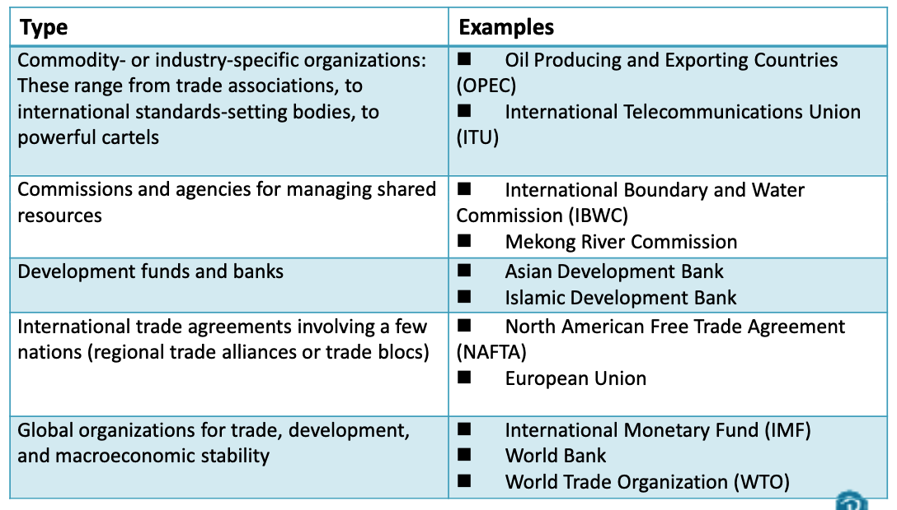
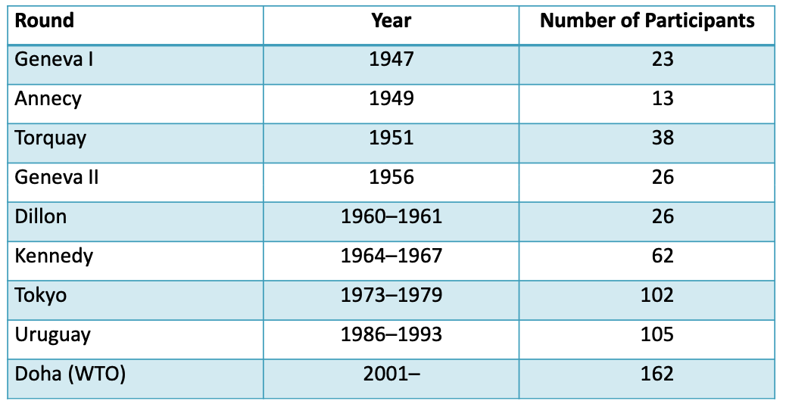

# International Economics Institutions Since World War II

## International Institutions since World War II

Economists define institutions as the rules that govern and constrain behavior.

- Institutions define what is permitted and what is prohibited.
- Institutions can be formal or informal.
  - Formal institutions are written, often embodied in laws, codes, constitutions.
  - Informal are customs or tradition such as manners and etiquette. 
- Formal institutions are often be embodied in a organization

## The IMF, the World Bank, and the WTO

### The IMF

- The IMF was created at Bretton Woods in 1944.
- It began operation in 1945 with 29 members;  today it has 188.
- It is funded ==by a quota each member pays==; the quota is proportional to the size of their economy and determines how many votes it has.
- The primary purpose of the IMF is to assist in the creation of a ==stable, crisis free, system of international payments== between countries.
- Its main activities are to provide ==technical and financial assistance== to countries that have debt problems or an unstable currency. 
- The IMF is an ==**international lender** of **last** resort`手段`==.
  - It provides loans to countries that cannot make payments on their debts and that cannot borrow elsewhere.
  - The loans are **limited in size** and **come with a set of requirements**, called IMF conditionality.
- The IMF monitors exchange rates and assists countries when their currencies collapse in value.
- An increasingly important role is to provide standards and technical assistance for the international reporting of economic and financial data.

### The World Bank

- Also created at Bretton Woods with a membership and structure similar to the IMF.
- Countries buy shares and the number of shares determines their voting rights.
- Originally intended as a mechanism to rebuild Europe after World War II
- Its main function today is to ==provide capital and technical assistance== for economic development

### The GATT

- The **General Agreement on Tariffs and Trade** (GATT) was envisioned at Bretton Woods but did not start until 1950.
- Its main purpose is to provide a ==forum for discussing trade rules and a mechanism== for gradually opening markets to more international trade.
- The GATT works through trade rounds.
  - **Trade rounds** are formal discussions about new rules for reducing trade barriers
- Initially the GATT focused on proportional tariff reductions and elimination of quotas.
  - It did not promote free trade, it promoted “freer” trade.
  - Proportional tariff reductions require each country to reduce tariffs by the same percentage but tariffs remain different.
- By the 1970s, new issues arose that required discussion and negotiations:
  - Subsidies for industry that gave advantages;
  - Problems of selling goods at artificially low prices;
  - Barriers to trade in new areas, such as services
- The **Uruguay Round** was a new set of rules that began in 1995.
  - It created the World Trade Organization to serve as the umbrella organization for all agreements.
  - It extended trade agreements into services, agriculture, patent protections, international investment rules, and others.
- In 2001, the **Doha Round** opened discussion.
  - Its primary focus was meant to be on the issues of concern to developing countries.
  - It proposed a Doha Development Agenda 
  - It is the first round of talks to fail;  a major reason is the inability of advanced economies to lower their trade barriers in agriculture.
- The GATT remains in effect and is the primary agreement overseen by the WTO.
- The two guiding principles of the GATT are **national treatment** and **nondiscrimination**.
  - National treatment means that foreign goods must be treated the same as national goods.  
  - Nondiscrimination prohibits different tariffs or rules for different countries.  This is the principle of **most favored nation status**.
- All WTO members must adhere to these rules when trading with other WTO members

## Regional Trade Agreements

Regional trade agreements (RTA) can be:

- Bilateral (two members)
- Plurilateral (several members)
- Multilateral (open to everyone that wants to join)

There are five levels of RTA

- Partial agreement: Free trade in one or a ==few== products
- Free trade area: Free trade in ==all== goods and services (outputs)
- Customs union: An FTA plus a ==**common external tariff**==.
- Common market: A customs union plus ==free movement of labor and capital== (inputs)
- Economic union: A common market plus ==substantial`丰富的` harmonization`一致` of economic policies==

Examples of prominent RTA: 

- North American Free Trade Agreement (NAFTA);
- Common Market of the South (Mercosur);
- ASEAN Free Trade Area (AFTA);
- Economic Community of West African States (ECOWAS);
- Gulf Cooperation Council (GCC);
- The European Union (EU).

RTA have grown in number. In 2012, 338 were active, most of them created since 1990. 

Most agreements have exceptions: free trade agreements do not usually have 100% free trade. 

RTA violate the nondiscrimination rule of the GATT and WTO; countries treat member countries better than others.

- The WTO allows this as long as **trade creation** is greater than **trade diversion`转移`**.
  - Trade creation: New trade created by the agreement;
  - Trade diversion:  Trade that is diverted from a non‐member to a member.

Proponents`赞成者` of RTA claim the following:

- They help world trade by reducing some barriers;
- They allow countries to try new agreements that can potentially be used later in WTO negotiations;
- They encourage WTO agreement by offering an alternative in case the WTO is stalled

Opponents`反对者` argue:

- They divert attention from multilateral negotiations and undermine the WTO;
- They rarely, if ever, lead to a WTO agreement;
- They often discriminate against poorer nations.

## Why Have International Institutions? 

==**IMPORTANT**==

International institutions provide **public goods**.

- Public goods are **nonexcludable**: Everyone benefits even if they do not pay.
- Public goods are **nonrival**`非竞争性` (nondiminishable): They are not diminished by consuming them. `不会因使用而减少`
- Public goods have a **free rider problem**`搭便车问题`.

The two most important characteristics of public goods provided by international institutions are:

- Increased international economic ==order==;
- Increased ==certainty== about the behavior of other nations

### Four Public Goods Provided by International Institutions

- ==Open markets== in recessions `经济衰退时推动开放市场` (GATT/WTO);
- Capital flows ==to less‐developed countries== (World Bank);
- International ==money for paying international debts== (IMF);
- ==Last resort lending== (IMF)

## Criticisms of International Institutions

**Sovereignty`主权` and transparency`公开透明`**

- Countries receiving assistance, particularly from the IMF, are sometimes required to give up the ability to set their own policies.
- Decision making in the institutions is not transparent;  because the U.S. and Europe have the largest voting bloc, decisions are sometimes viewed as having been directed by rich countries

**Ideology`意识形态`**

- Critics argue that the advice, technical assistance, and negotiating positions are often a reflection of the biases and ideologies of high income countries and do not adequately consider alternative policies.

**Implementation and adjustment costs**

- There are asymmetries`不对称` in the fiscal burdens associated with implementing agreements and adjusting to the changes they create; richer countries do better at this than poorer ones

# Tutorial 

1. Give the arguments for and against regional free trade (RTAs) agreements. How might the signing of a free trade agreement between the United States, Central America, and the Dominican Republic have harmed Bangladesh?
   - - Pro: Freer, more open trade. Easier to reach agreements for a frw countries on difficulties matters than it is for a large number of countries to reach the same agreements
      - Con: RTAs undermine progress towarrd multilateral agreements. RTAs polarize`两极化` countries and discrimateagainst non-members and because they disadvantage smaller countries that enter agreements with large ones.
2. What are public goods and how do they differ from private ones? Give examples of each. 
   - Public goods are non-excludable and non-diminishable; 
   - Private goods don't share the same characteristics and private goods include many things that are brought on sold in private markets (clothing, houses, cars, etc.)
3. Describe the main functions of each of the following: The IMF; The World Bank; The GATT; The WTO.
   - The IMF - lender of last resort
   - The World Bank - assistance with the economic development of nations through...
   - The GATT - to keep the markets for goods open and to ensure that nations follow set of rules governing fair trade.
   - The WTO - is an umbrella organization, similar to the GATT's but it has expanded its function to include agreements on services, agriculture, textiles, and apparel etc. 
4. What are the five main types of regional trade agreements and what are their primary characteristics?
   - A partial trade agreement: 
   - A free trade area: 
   - A custom union: 
   - A common market: 
   - An economic union