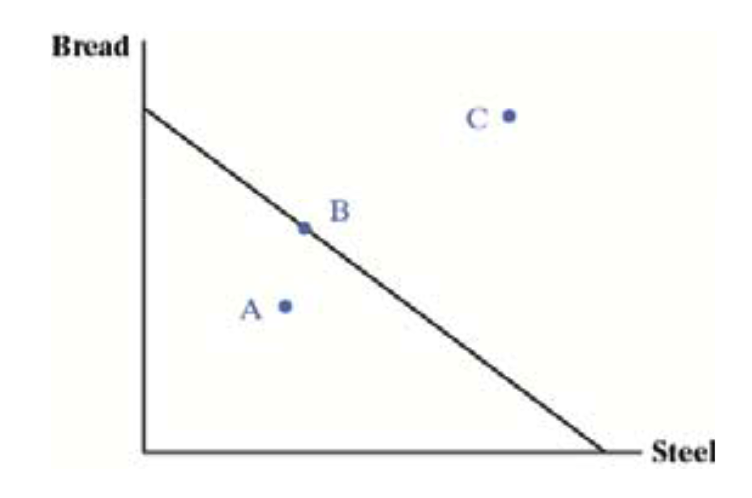
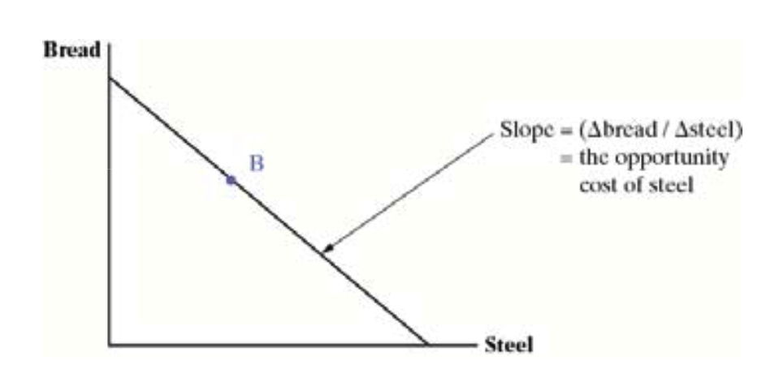
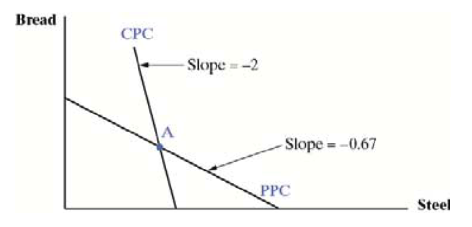
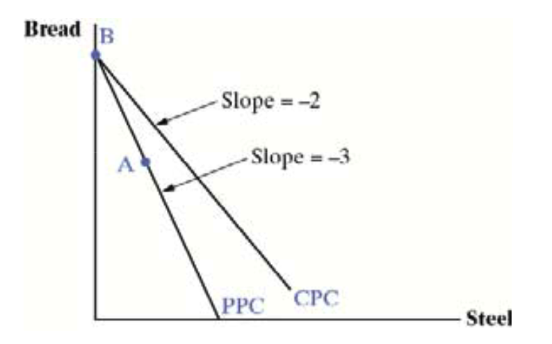

# Comparative Advantage and the Gains from Trade

## Learning Objectives

3.1 Analyze numerical examples of absolute and comparative advantage.

3.2 Draw a diagram showing gains from trade.

3.3 Numerically compare and contrast absolute and comparative advantage.

3.4 Explain how a country with no absolute advantage can still gain from trade.

3.5 Contrast the concepts of comparative advantage and competitiveness.

3.6 Discuss the economic and ethical considerations of economic restructuring caused by international trade.

## Adam Smith and The Wealth of Nations

Smith published his great work in 1776: *An Inquiry into the Nature and Causes of the Wealth of Nations*. 

He criticized the dominant school of thought, called **mercantilism**`重商主义`

- Mercantilism is sometimes called the politics and economics of nation building.
- Mercantilists favored exports because they earned gold for a nation; they discouraged imports because they cost a nation its gold.
- Gold could be used to pay for armies and navies.

Smith’s arguments against mercantilism:

- Imports enable countries to live better;
- Voluntary exchange is positive sum, ==not zero sum==: both sisidesdes gain.
- Trade extends the market and ==enables specialization and innovation== and thereby creates wealth.
- Trade barriers shrink the size of the market and limit innovation and specialization.

Economists today mostly accept Smith’s critique of mercantilism and trade barriers.

Smith thought that every nation would be able to produce something **at lower cost than all other nations** - due to their soil, climate, mineral resources, or some other **unique factor**.

David Ricardo, writing in the early 1800s, demonstrated that trade was beneficial **even if a country had no special advantage** - or even if they had an advantage in everything.

##  A Simple Model of Production and Trade

- Economists illustrate the ideas of Smith and Ricardo with a 2x2x1 model

  - 2 countries
  - 2 goods produced
  - 1 input, call it “labor”

- Initially, we assume:

  - Competitive markets: no firms have market power
  - No technological changes
  - Constant returns to scale in production: Double the inputs and you double the outputs.
  - No transportation or trade costs
  - No money: All trade is barter.

- Labor is the sole input.  We assume:

  - Labor is completely mobile between the two sectors of production.
  - Labor is homogeneous: no skilled/unskilled or hard working/shirking distinctions.
  - Labor is fully employed:  Everyone that wants a job has one.
  - Labor is immobile between the two countries

- **Productivity**: The amount of output per unit of input.

- **Labor productivity**: Output per unit of labor

  $$
  \textit{Inputs} = \textit{Units of output}\ /\ \textit{Hours worked}
  $$

- **Absolute productivity advantage**:  Higher output per hour worked than a competitor.  More simply, this is called **absolute advantage**

### **Example**: Table 3.2 Output Per Hour Worked

- Each number is the units of output per hour worked
- Canada has an absolute advantage (= higher labor productivity) in bread
- The U.S. has an absolute advantage in steel

| Output | US       | Canada   |
| ------ | -------- | -------- |
| Bread  | 2 loaves | 3 loaves |
| Steel  | 3 tons   | 1ton     |

#### **Opportunity Costs**

In the U.S., the opportunity cost of steel is 2/3 loaves of bread

- Labor can be used to produce bread or steel
- Every worker taken out of bread reduces production by 2 loaves but increases steel by 3 tons

The opportunity cost is the domestic price of a good when there is no trade:  give up 2 bread and obtain 3 tons of steel

#### Opportunity Costs and Prices

We can write an algebraic expression for the price of steel  in the U.S. when there is no trade: 
$$
P^s_{US}=\dfrac{2\ \mathrm{loaves}}{3\ \mathit{tons}}=0.67
$$
Similarly, for Canada:
$$
P^s_{C}=\dfrac{3\ \mathrm{loaves}}{1\ \mathit{tons}}=3.0
$$
These are the opportunity costs of producing steel; the  opportunity costs of bread are the inverses

#### Opportunity Costs and the Gains from Trade

- The U.S. is better off if Canada will pay it more than 0.67 bread for a ton of steel
- And Canada is better off if it can buy steel at less than 3 bread per ton.
- As long as the trade price is less than the **opportunity cost** of producing a good, a country is better off buying it than making it
- The **gains from trade** are the increases in goods available through trade versus what a country can produce itself

#### The Trade Price

Trade prices will settle somewhere between the domestic costs of production in the two countries

- For stell
  $$
  3 > P_W^s>0.67
  $$
- For bread (the inverses): 
  $$
  1.5 > P_w^b>0.33
  $$

What if the price of steel is greater than 3 loaves of bread per ton?

- The U.S. benefits from specializing in steel and buying bread because it obtains more than 3 loaves for each ton
- Canada will decide to produce steel as well; the trade price is so much higher than its opportunity cost of producing it

**End result**: Neither country produces bread, the price of bread rises, the price of steel falls, and we are back between the two opportunity costs. There is a similar story if the price of steel is less than 0.67 loaves per ton.

### The PPC

The **production possibilities curve (PPC)** shows the ==tradeoffs between the two goods== in our simple model

It is a straight line because there is a constant tradeoff of bread for steel.

- Production inside the PPC is inefficient (does not use all available resources)
- Production outside is impossible
- Production  along the curve is full employment

Countries can produce anywhere on the curve, but they want to produce the output with the greatest value

- Greatest value is dependent on the trade price.

The **slope** of the PPC is the ==relative price== of the good on the horizontal axis. It is ==also the opportunity cost==

- In our example, the slope is the amount of bread given up per unit of steel

A **relative price** is the ==price of one good in terms of another==; the price of steel is measured in terms of bread

### The Situation Before Trade Begins

**Autarky** is the term given for countries that do not trade (==No Trade==)

- Can only consume what they produce
- The best they can do is to produce somewhere along their PPC
- The actual production point depends on the relative demands for bread and steel

### The Gains from Trade

Suppose the world (trade) price of steel is somewhere between the opportunity costs for steel in the US and Canada
$$
3 > P_W^s>0.67
$$

Let’s say the world price of steel is 2 loaves per ton
$$
P_W^s = 2.0
$$
The consumption possibilities curve (CPC) for the U.S. shows what the U.S. can consume when it produces at a point on its PPC and trades.

Its slope is – ( Δbread ) ÷ ( Δsteel ) = ‐2.

The slope of the CPC is the world price of steel, which is the trade price

When the **U.S.** increases steel output by 1 ton, it loses 0.67 loaves of bread

- But it gains 2 loaves when it trades with Canada
- Net gains from trade are 2 – 0.67 = 1.33 loaves.

When **Canada** increases bread output by 2 loaves, it loses 0.67 tons of steel output.

- But it trades 2 loaves for 1 ton of steel.
- Net gains from trade are 1 – 0.67  = 0.33 tons of steel

### Maximizing the Value of Output

- Canada and the U.S. can produce anywhere on their PPCs.
- What point on the PPC maximizes the consumption possibilities?
- Consumption possibilities are maximized when we are on the CPC that is furthest out from the origin
- Maximizing the value of output maximizes the gains from trade

### Absolute Advantage versus Comparative Advantage

- **Absolute advantage** means a country has greater labor productivity
- **Comparative advantage** means a country has a lower ==opportunity cost==
- - The U.S. has an absolute advantage in steel because 3 tons per hour > 1 ton per hour
  - The U.S. also has a comparative advantage in steel because 0.67 loaves per ton < 3 loaves per ton

### What if a Country Has No Absolute Advantage?

- It still benefits from trade

|       | Japan  | Malaysia |
| ----- | ------ | -------- |
| Cars  | 2 cars | 0.5 cars |
| Steel | 2 tons | 1 ton    |

- Japan has an absolute advantage in both goods, but a comparative advantage is cars; 

  Malaysia has an absolute advantage in nothing, but a comparative advantage in steel. 

- The world price of cars will settle between 1 and 2 tons of steel per car.  Let’s say 1.5.

- Japan specializes in cars and trades 1 car for 1.5 tons of steel. It is better off because making steel costs 1 car per 1.0 tons

  Malaysia specializes in steel and trades 1.5 tons for a car.  It is better off because making cars costs 2 tons per car

### Case Study:  Republic of Korea

South Korea developed rapidly after the Korean War ended in 1953. It has one of the best growth records of any country. 

It gradually increased its comparative advantage in higher and higher valued products

Export industries played a key role

- Competitive advantage means selling at a lower cost
- Comparative advantage means having a lower opportunity cost
- Comparative advantage = competitive advantage when markets are perfectly competitive and the prices of all inputs and outputs reflect their relative scarcity
- Comparative advantage ≠ competitive advantage when prices do not reflect the relative scarcity. When prices do not reflect the relative scarcity.  When is that?
  - In trade, this occurs mostly when governments supply protection or subsidies
  - Protection drives up the price of imports
  - Subsidies drives down the private cost of production
- Countries can be internationally competitive in industries where they do not have a comparative advantage if they receive subsidies. 

### Economic Restructuring

- When trade begins, economies move from one point to another on their PPC.  In our simple model, the U.S. bread industry and the Canadian steel industry disappeared.
- Both economies underwent **economic restructuring**: some industries grew, others shrank
- Both Canada and the U.S. benefitted, but not necessarily every individual—bread workers in the U.S. and steel workers in Canada must change jobs

- In our simple model, everyone is employed, workers are equally adept at both industries, and there are no costs associated with changing jobs
- In the real world:
  - Not everyone can easily find a job
  - We are not equally adept at any industry
  - It costs money, time, and psychological resources to move from one place to another

- Most countries have programs to **ease the burden of job losses caused by trade**

  - In the U.S., this is called trade adjustment assistance (TAA)

    TAA is justified by several arguments: 

    - Trade makes the nation better off;  the winners can compensate the losers and still gain
    - Fairness
    - Not doing so creates a backlash that endangers trade and the gains from trade
