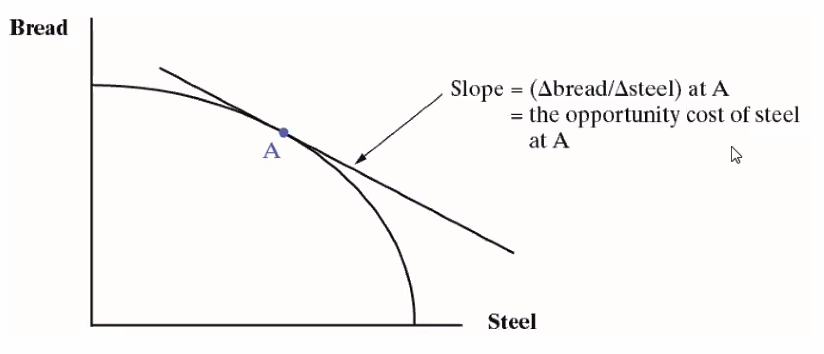
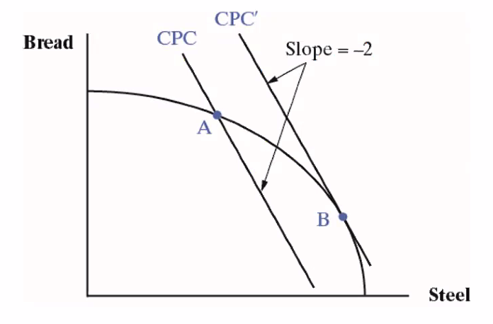
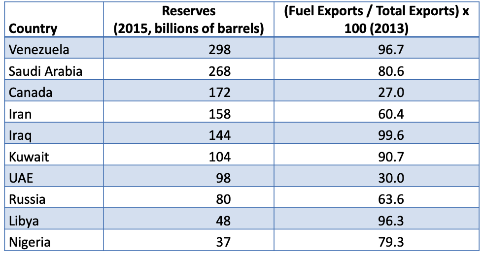
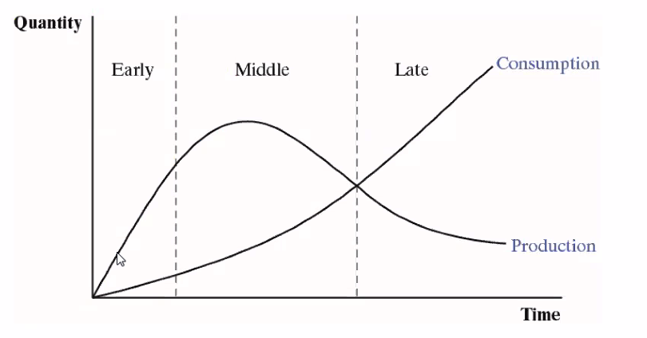
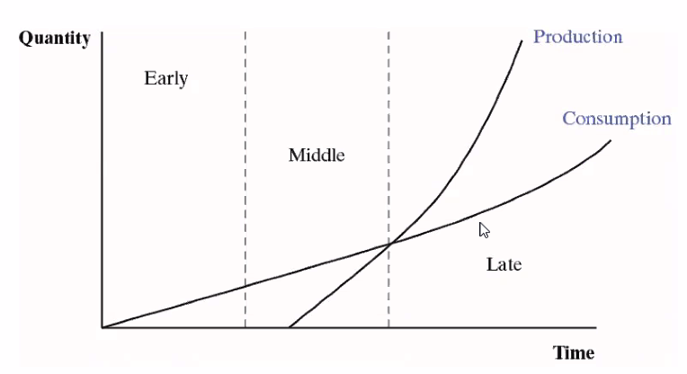
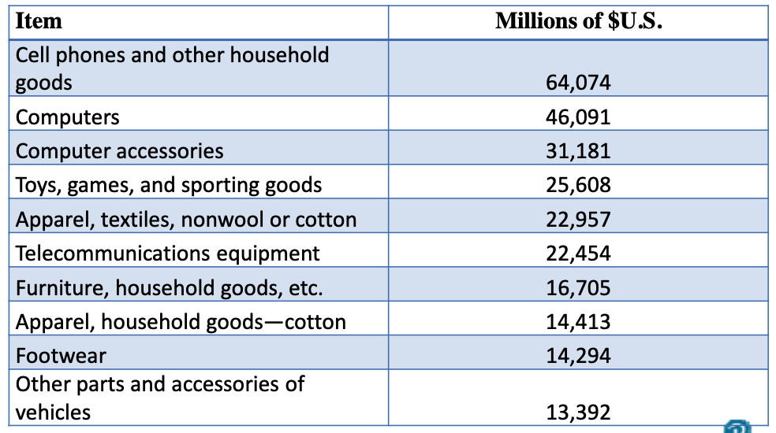

# Comparative Advantage and Factor Endowments

## Learning Objectives

4.1 Use the ==**Heckscher‐Ohlin Trade Model**== to analyze ==trade patterns== between ==two countries== with two ==inputs== and ==two outputs==

4.2 ==Predict the impacts== on different factors of production of trade opening

4.3 Discuss the ==limits== of the HO model

4.4 Explain the ==trade‐offs== for firms between ==trading and investing internationally==.

4.5 Give examples of the determinants of international migration ad its impact on comparative advantage

4.6 Describe the controversies surrounding the impact of international trade on wages and jobs.

## The Heckscher‐Ohlin Trade Model

- Eli Heckscher and Bertil Ohlin:  20th century Swedish economists. 
  - Best known for their model explaining patterns of international trade.
  - Also called the factor proportions model.
- **HO Model idea**:  The relative abundance of different ==factors== of production (inputs) determine which country has a comparative advantage in which goods.
- The HO Model: 2x2x2
  - 2 inputs, called labor and capital
  - 2 outputs, called bread and steel
  - 2 countries, called the U.S. and Canada
- **Relative factor endowments** are ==the ratios of== capital to labor.
  - Written:  K/L

|         | US          | Canada     |
| ------- | ----------- | ---------- |
| Capital | 50 machines | 2 machines |
| Labor   | 150 workers | 10 workers |

- Factor abundance depends on the ratios of K to L.
  - $K_{CA} / L_{CA} = 2 / 10 = 1/5$
  - $K_{US} / L_{US} = 50 / 150 = 1/3$
- Since $K_{US} / L_{US} > K_{CA} / L_{CA}$  the US is ==capital abundant== compared to Canada and Canada is labor abundant compared to the U.S
- Relative factor abundance determines which goods a country will export and import
  - Relative abundance means the input is relatively less expensive than the other input
  - Relative scarcity`匮乏` means the opposite
  - Capital is relatively cheap in the US, labor is relatively expensive. Vice versa for Canada

> HO Model: Countries will have a comparative ==advantage in== the production of goods that ==intensively use their relatively abundant factor==

- In our model with bread and steel, assume the recipe for steel requires relatively more capital per unit of labor than bread.
  - Steel is capital intensive, bread is labor intensive
  - The U.S. is capital abundant, it will have a comparative advantage in steel
  - Canada is labor abundant, it will have a comparative advantage in bread
- The HO Model predicts that the U.S. exports steel, imports bread
- Unlike the Ricardian Model:  Incomplete specialization
- In the real world: The U.S., compared to other countries, is relatively abundant in:
  - **Capital**
  - Certain **natural resources** such as agricultural land
  - **Skilled labor,** particularly scientific, engineering, and managerial
- According to HO, the U.S. should ==export capital intensive== goods (example:  aircraft); agricultural products (example:  grains); and technology (example: pharmaceuticals).

## The PPC `production possibility curve` with Two Factors

- The Ricardian model of Chapter 3 assumed one homogenous input with a constant tradeoff between the two goods
  - Complete specialization
- The HO Model assumes two inputs and different input requirements for each good
  - Steel takes more capital, less labor
  - Bread takes more labor, less capital
- This produces a PPC that is convex`凸的`
  - The opportunity cost increases when we produce more of one good because we are moving inputs that are less suited to the good with expanding output.
  - Incomplete specialization

## Income Distribution Effects of Trade in the HO Model

- Ricardian Model: Every individual benefits from trade.
  - One input, labor
  - Labor is homogeneous and moves without friction between sectors
- HO Model: **Not** every factor of production benefits
  - Two inputs, labor and capital
  - Owners of labor or capital may be harmed, ==depending on which output shrinks== when trade begins
- Trade moves an economy along its PPC, increasing output of one good, shrinking output of the other
- Income for owners of capital and labor ==**depends on how much demand there is for their services**==.
  - This is called **derived demand**`衍生需求`
- The demand for their services depends on what is produced
  - In the bread and steel example, the US increased output of steel which uses more capital, less labor
  - The incomes of both factors will be affected
- In our example, the price of steel increased in the US, bread fell. The opposite was true in Canada
- The Stolper‐Samuelson Theorem:
  - An **increase** in the price of a good **raises the income** of the factor used intensively in its production
  - A **decrease** in the price of a good **lowers the income** of the factor used intensively in its production
- - US:  returns on capital increase, wages fall
  - Canada:  returns on capital fall, wages rise

## Income Distribution in the Short Run

- The HO Model as presented describes the long run, after all changes have worked through the economy
  - We assumed workers and capital owners could effortlessly move from bread to steel and back, as needed
  - In the ==short== run, however, they may be stuck
- The Specific Factors Model describes what happens
  - Three factors:  Land, Labor, and Capital
  - Two outputs:  bread and steel
  - One factor is specific to each output: 
    - Bread is made with labor and land
    - Steel is made with labor and capital
- After trade begins:
  - US landowners see a decline in the demand for land, incomes fall.  Owners of the specific factor used intensively in the declining industry are hurt
  - US capital owners see an increase in demand for capital, incomes rise. Owners of the specific factor used intensively in the expanding industry are better off
  - Labor? 
    - Some move from bread to steel, but  since steel is not labor intensive, their wages fall (same as HO).
    - However, bread is cheaper, they are better off in that way
    - Steel is more expensive, they are worse off from that
    - Net result is indeterminate

## Case Study:  Comparative Advantage in a Single Natural Resource

- The **resource curse**: The abundant endowment of a single valuable resource can crowd out other economic activities.
  - Labor and capital become concentrated in the production of the resource because it is so valuable. It is so hard to develop alternative industries
  - In countries with weak institutions, fighting over the gains from the resource hinders economic development
- The resource curse is not inevitable:  see Canada

## Empirical Tests of the Theory of Comparative Advantage

- Tests of the Ricardian Model are relatively successful in predicting export patterns.
  - In this model trade is driven by productivity differences
- Tests of the factor endowment (HO) model of trade yield mixed result 
  - Empirical tests are difficult:  How to measure factor endowments?  Prices in autarky?
  - Trade is also affected by technological differences.  We assumed the same technology in the two trading economies but in reality, different countries have different technologies.
  - Other factors are also important:  economies of scale, corporate structures, economic policies

## Extensions of the HO Model:  The Product Cycle

The **product cycle** describes ==how production migrates== ==from high income==, advanced economies ==to middle income== developing economies

- **Early stage** of production:  Locate in high income country
  - Need science and engineering skills to develop new product
  - Need high income consumers to try it out, provide feedback
- **Middle stage** of production, location begins to shift
  - Design and production processes beginning to be standardized
  - Mass production beginning.
  - Labor costs begin to matter more.
- **Late stage**:
  - Production moves where labor costs are low.
  - The product is completely standardized

## Case Study: China’s Top 10 Exports to the U.S.

- The product cycle and China’s labor endowment explain many of their top exports to the U.S.
  - Standardized production:  cell phones, computers, telecommunications equipment
  - Labor intensive production:  toys, games, sporting goods, furniture, apparel, footwear.
- Over time, China moves up the ladder of comparative advantage, producing more capital intensive and skilled labor intensive goods

## Extension of the HO Model:  Investing versus Trading

- In the HO Model, countries export one thing, import something different
- In the **product cycle**, firms invest abroad and some output may be sent back home
  - A significant share of imports are **intrafirm trade**: Trade within one firm.  
  - In the mid‐1990s, around 1/3 of U.S. goods exports and 2/5ths of imports were intrafirm
- The **OLI theory** explains why firms choose to invest abroad instead of trading
  - O:  **Ownership** of an asset that makes a firm competitive, e.g., technology, trademark, reputation, etc
  - L:  **Location** abroad offers some advantage, such as proximity to markets, lower production costs, etc.
  - I:  **Internalization** of the advantage instead of subcontracting or selling the right to produce the product
- - **Outsourcing** refers to moving some part of production to another firm, either inside the home country or outside
  - **Off‐shoring** refers to moving some or all of production abroad
    - If a firm off‐shores but does not outsource, it is working with a **foreign affiliate**
    - All combinations of off‐shoring and outsourcing are possible
- Modern telecommunications and transportation make off‐shoring easier today
- This heightens worries about the effects of off‐shoring.
  - The loss of manufacturing jobs.
  - Technology theft (non‐enforcement of patents, etc.)
  - Services might be next:  medical services, accounting, IT, etc., delivered over the internet

## Extension of the HO Model: Internationally Mobile Labor

- The HO Model assumes that workers cannot move across international borders.
- In 2013, there were an estimated 231 million international migrants.
  - 20 percent were in the U.S.
  - Two thirds were in high income countries
- In theory, labor inflows can influence comparative advantage by changing the labor endowment
  - In the U.S. in the 1980s, the inflow of low skilled immigrants from Central America caused growth in California’s apparel sector.
  - U.S. agriculture relies on immigrant workers.
  - Immigrants in some countries work mainly in sectors producing non‐traded goods—construction, nursing, etc.
- Economic analysis of **migration relies on three dominant factors**:
  - **Demand** pull factors:  Pull migrants in (jobs higher wages, promises of a better life, etc.)
  - **Supply** push factors:  Push migrants out of their home country (poverty, wars, persecution, etc.)
  - **Social networks**:  Determine where they settle in the receiving country (where there are family, friends, community members from home).

### Trade, Wages, and Jobs

- The industry and location of jobs (kinds of jobs) may be affected by trade.
  - Moving along a PPC.
  - There may be short run effects on jobs in particular industries.
- The overall number of jobs is not determined by trade;  other factors are far more important.
  - Fiscal and monetary policies.
  - Labor market policies
- Manufacturing is the most discussed case.
  - Productivity increases reduce the need for labor.
  - Services and manufactured goods production expand with income, but more and more labor ends up in services because its productivity does not rise as fast as in manufacturing.
- Much more manufacturing production today is exposed to international competition.
  - Growth of China and other emerging economies.
  - Transportation and telecommunications revolutions

Q:  Does trade with emerging markets cause wages to fall in high income economies?

A:  Economists are not certain

- Trade may play some role in wage stagnation in advanced economies.
- But it is also possible that it has little or no effect.
- Many possibilities:  For example, automation reduced the need for labor in manufacturing.
- We need more research on this topic

Suppose trade causes jobs to be lost at home, wages to fall.  What should we do?

Options: 

- Stop trading and block off‐shoring;
- Selectively block imports and off‐shoring;
- Keep trading and investing but assist workers.
- Do nothing.

Each option has costs and benefits