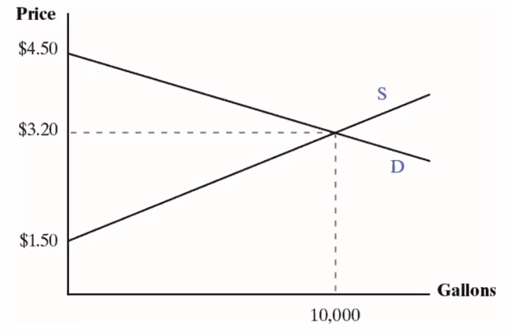
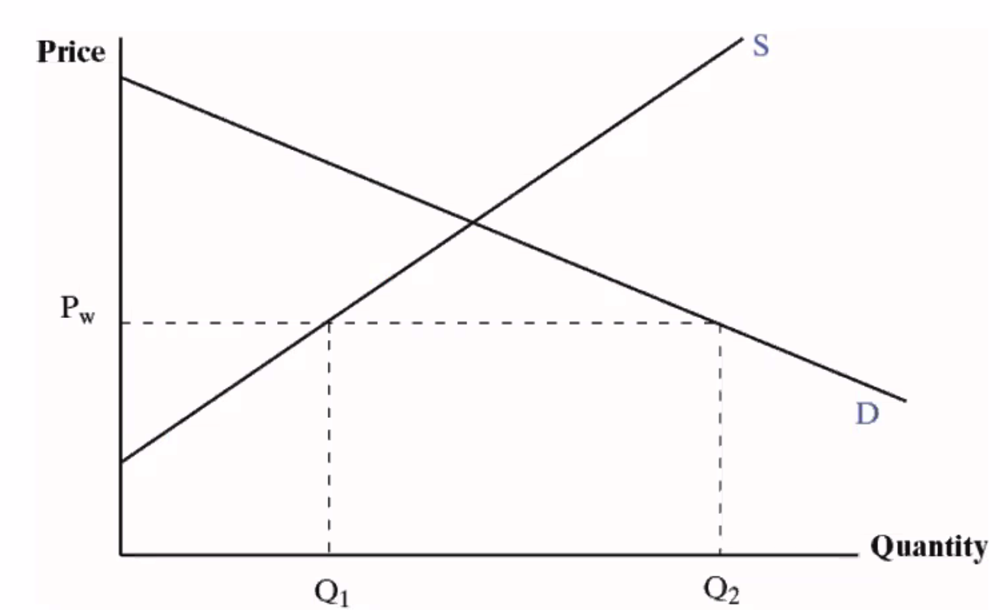
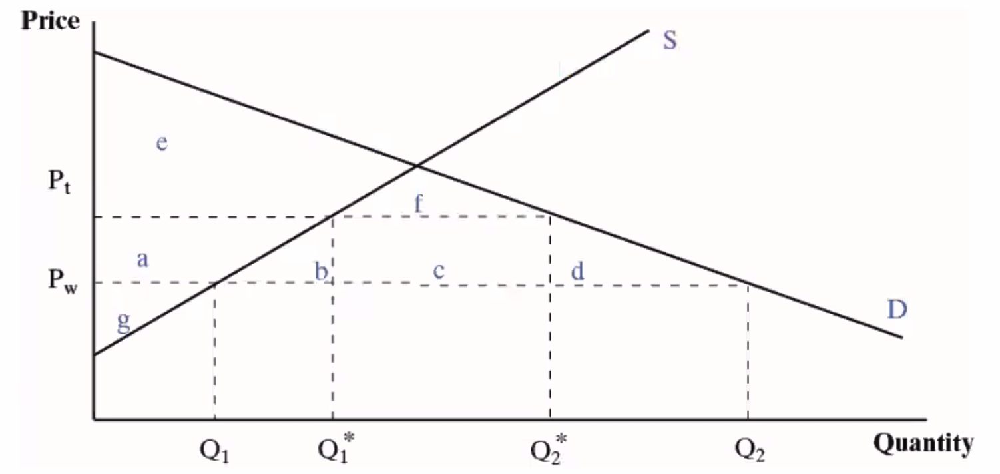
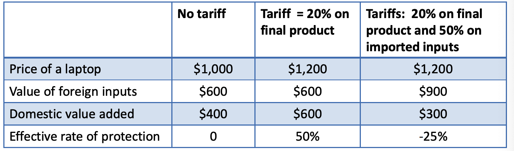
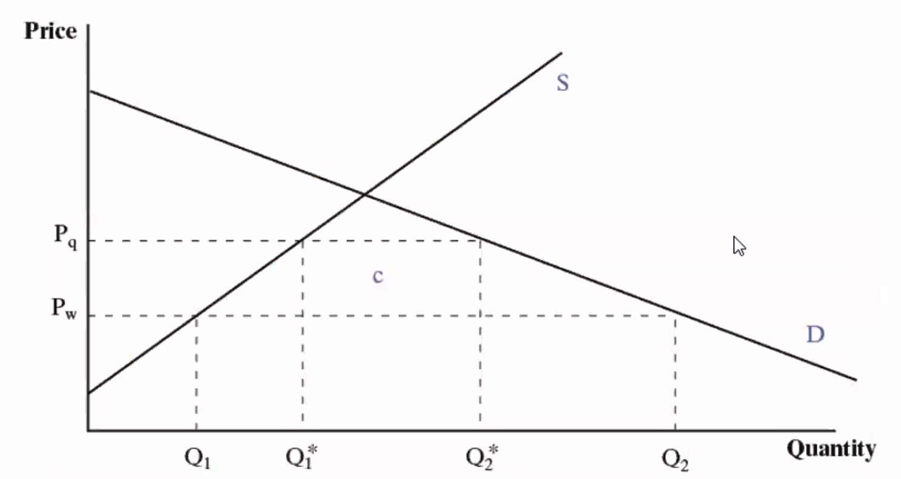

# The Theory of Tariffs and Quotas

## Learning Objectives

6.1 Use supply and demand analysis to explain and illustrate consumer and producer surplus.

6.2 Graphically demonstrate the effects of tariffs and quotas on prices output and consumption for and quotas on prices, output, and consumption for small and large countries.

6.3 Differentiate and explan the resource allocation and income distribution effects of tariffs and quotas.

6.4 Use tariff data on inputs and outputs to compare effective and nominal rates of protection.

6.5 Compare and contrast quotas and tariffs.

## Introduction to Tariffs and Quotas

A **tariff** is a ==tax== on imports.

- It may be a set amount: $5 per ton of steel.
- Or, it may be a percentage: 10% of the import value

A **quota** is a ==physical limit== on import ==quantity==.

- Quotas come in many forms, for example import licensing requirements or voluntary export restraints.
- The analysis is similar to a tariff, although the effects are slightly different

Tariffs and quotas cause changes in the production, consumption, and importation of the good on which they are levied`征税`

- Production at home increases.
- Some consumption switches from foreign goods to domestic, but overall consumption decreases
- Imports decline
- There are changes in other industries and on the performance of the economy as a whole as the effects work through the system

## Analysis of Tariffs and Quotas

**Consumer surplus**`消费者剩余` is the ==value== of a good or service that is in ==excess== of what a consumer ==has to pay==. 

- Example: You are willing to pay \$100 for a pair of shoes, but can buy them for \$60. Your consumer surplus is \$40. 
- Graphically, in a supply and demand system, it is the area under the demand curve and above the price. Different consumers have different levels of consumer surplus. 

**Producer surplus** is the ==revenue== received by producers that is in ==excess of the minimum they need to produce== a given amount. 

- Example: You are willing to sell shoes you made for \$40 a pair but you can get \$60. Your producer surplus is \$20. 
- Graphically, in a supply and demand system, it is the area above the supply curve and below the price. 
- Different producers have different levels of producer surplus. 

**Assume** the following:

- There is *perfect competition*, so no tariffs or quotas.
- There is one *world price* (setting aside transportation costs): Pw 
- Foreign producers are willing to supply us with all we demand at Pw .
- $P_w$ is *below the domestic equilibrium price*

**Result**

- The **home country imposes a tariff**. 
  - The import price remains $P_w$ but importers must pay a tariff to the government, amount t. 
  - The domestic price rises to:  $P_t = P_w + t$. 
- **Domestic production increases**. 
  - Domestic producers can raise prices to $P_t$.
- **Domestic consumption falls**. 
  - Prices have gone up.
- **Imports fall**.
  - More of the consumption is supplied by domestic firms.

### Resource Allocation and Income Distribution Effects

**Before** the tariff was imposed: 

- Consumer surplus: a + b + c + d + e + f. 
- Producer surplus: g. 

**After** the tariff:

- Consumer surplus: e + f. This is a loss of a + b + c + d. 
- Producer surplus: a + g. This is a gain of a. 

The resource allocation effects can be broken down into losses on the production side and on the consumption side.  

- **Deadweight loss`无谓损失`:** A destruction`毁灭` of consumer or producer surplus that is ==not matched by a gain elsewhere in the system==. Deadweight losses can be either consumption side or production side.
- **Efficiency loss:** A deadweight loss on the ==production side==. 
- The income distribution effects `收入分配效应` are changes caused by the re-distribution of consumer and producer surplus. 
- Areas a through d marked in Figure 6.3 are either an income distribution effect or a resource allocation effect of the tariff.

| Variable                                |  Free Trade   | Post-Tariff  |
| --------------------------------------- | :-----------: | :----------: |
| Price to consumers                      |     $P_w$     |    $P_t$     |
| Domestic consumption                    |     $Q_2$     |   $Q_2^*$    |
| Domestic production                     |     $Q_1$     |   $Q_1^*$    |
| Imports                                 |   $Q_1Q_2$    | $Q_1^*Q_2^*$ |
| Consumer suplus                         | $a+b+c+d+e+f$ |    $e+f$     |
| Producer suplus                         |      $g$      |    $g+a$     |
| Government revenue                      |      $0$      |     $c$      |
| Deadweight consumption loss             |      $0$      |     $d$      |
| Deadweight production (efficiency) loss |      $0$      |     $b$      |

### **Other Costs of Tariffs** 

- **Retaliation**`报复` by other contries
- **Innovation**`创新`
  - Tariffs on imported machinery may slow the adoption of new techniques; techniques;
  - Protection reduces incentives to increase productivity, improve products. 
- **Rent seeking**: Firms spend time and money ==seeking protection rather than increasing productivity==. 

### Case Study: A Comparison of Tariff Rates

Over time, tariffs have fallen worldwide. 

There are several patterns: 

- Generally, tariffs are lower in high income countries
- Tariffs tend to be higher in lower income countries partly because they rely on them for government revenue. 
- Tariffs are higher in agricultural products, apparel manufacturing, and textiles.

### Nominal and Effective Rates of Protection

- The **nominal rate of protection**`名义保护率` is the ==tariff rate==.
- The **effective rate of protection** is the ==percentage change in the value added== after the tariff is levied. 
  - **Value added** is the value of a good minus the costs of the intermediate inputs. It measures the contributions of labor and capital to production at a given stage.

$$
\text{Effective Rate of Protection} = (\mathit{VA}^*-\mathit{VA})/\mathit{VA}
$$

Where: 

- $\mathit{VA}$: domestic value added with free trade
- $\mathit{VA^*}$: domestic value added after all tariffs are taken into account

The effective rate of protection is higher than the nominal rate if there are no tariffs on imported inputs. Tariffs on imported inputs reduces the effective rate and can even turn it negative

## Quotas

Quotas are physical limits on imports. 

- **Differences** between quotas and tariffs:
  - Quotas do not generate revenue for the government. (==No Gov Revenue==) 
  - ==Increases in foreign productivity== do ==not result in lower prices== with a quota but they do with a tariff. 
  - Quotas ==can increase foreign profits==. 
- **Similarities** between quotas and tariffs
  - Both ==reduce imports==; for any quota, there is a tariff equivalent; 
  - Both ==increase domestic prices==, ==reduce domestic consumption==, ==increase domestic production.==
- When a quota is imposed `force to put`, the price increases due to the limits on availability.
- All of the analysis is similar to the analysis for a tariff, except for government revenue. 
  - With a tariff, consumers transfer to government an amount equal to the tariff times the quantity of imports. 
  - With a quota there is no government revenue. 
  - Foreign producers raise prices; the increase in the price times the imports is added revenue for them. These are called **quota** **rents.** $\Delta P \times Q^*_{\text{Imports}}$
  - Some of the revenue may be captured by domestic distributors of the product

- When a tariff is imposed, foreign producers can still increase their share of the market by becoming more efficient. 
  - Productivity increases by foreigners allow them to lower their prices and gain more of the market. 
- When a quota is imposed, no matter how efficient foreign producers become, they cannot increase their share of the market. 
  - All future increases in the size of the market go to domestic producers

- Quotas come in several different forms. Two common ones are:
  - **Voluntary export restraints (VER)** are agreements between an importing and exporting countriesto voluntarily limit exports. 
  - **Import licensing requirements** are requirementsthat any importer must obtain a license; the number of licenses and p ; amounts are limited.

- Quotas and the WTO

  - When countriesjoin the WTO, they agree to eventually convert quotas to tariffs. 
  - Tariffs are more transparent and still allow competition between domestic and foreign firms. 
  - The WTO does not allow VERs. 

## Other Forms of Protection

- **Nontariff barriers:** Quotas and nontariff measures.  
- **Nontariff measures:** Other measures`措施` that limit imports They are sometimes nontransparent imports. They are sometimes nontransparent and even unintentional. For example: 
  - Overly complicated customs procedures. 
  - Health and safety measures. 
  - Technical standards. 
  - Government procurement rules. 
  - Environmental rules.  

## Case Study: Intellectual Property

- **Intellectual property rights** consist of: 
  - Patents; 
  - Copyrights and trademarks; 
  - Industrial designs; 
  - Geographical designations; 
  - Integrated circuit layouts
- The Trade Related Aspects of Intellectual Property Rights Agreement (TRIPS) governs the rights and responsibilities of countries that are WTO members
- Lack of intellectual property rights enforcement is considered a nontariff measure because it limits trade flows. 
  - Firms do not want to sell in a market where their intellectual property will be stolen or copied illegally. 
- Intellectual property rights are a controversial topic in trade discussions. 
  - High income countries in particular want greater enforcement High income countries, in particular, want greater enforcement. 
  - Some countries (U.S., for example) want longer, broader, patents. 
  - Low and middle income countries want more access to technology. 
  - In addition, the costs of implementing and enforcing intellectual property rights is a burden in many poor countries. 
- Example: Pharmaceuticals`药物`
  - Should poor countries be allowed to copy pharmaceuticals (break the patent) that are life saving when they cannot afford to buy them from the companies that developed them?

# Tutorial

2. Suppose the world price for a good is 40 and the domestic price demand-supply curves are given by the following equations:

   $$
   \text{Demand}\quad P = 80-2Q\\[1ex]
   
   \text{Supply}\quad   P = 5 + 3Q
   $$
   

   1. How much is consumed? 
   $$
   40 = 80 – 2Q\\[1ex]
   
   2Q = 40\\[1ex]
   
   Q=20
   $$

   2. How much is produced at home?
   $$
   P = 5 +3 Q\\[1ex]
   
   
   40 = 5 +3 Q\\[1ex]
   3 Q = 35\\[1ex]
   
   Q = 11.67
   $$

   3. What are the values of consumer and producer surplus?
      - Consumer surplus: 20 x (80 – 40) x ½ = 400 refer to graph for consumer surplus area
      - Producer surplus: 11.67 x (40 – 5) x ½ = 204.17 refer to graph for producer surplus area
   4. If a tariff of 10% is imposed, by how much do consumption and domestic production change?
      - 10% of 40 = 4 (tariff), price goes up from 40 to 44.
      - Consumption moves along the demand curve: 44 = 80-2Q, or Q =18
      - Production moves up the supply curve: 44 = 5 + 3Q, or Q = 13
   6. What is the change in consumer and producer surplus?
      - Consumption surplus = 324 (down by 76)
      - Producer surplus = 253.5 (up by 49.33)
   7. How much revenue does the government earn from the tariff?
      - Tariff revenue = 5 x 4 = 20
   8. What is the net national cost of the tariff?
      - Combination of the efficiency loss and the consumption deadweight loss, i.e. the lost consumer surplus minus the transfer to producers and government.
      - 76 – 49.33 – 20 = 6.67 

---

3. Under what conditions may a tariff actually make the country better off?

   Country must be large enough to affect the world price when it imposes a tariff, and other countries must not retaliate. 

---

4. In addition to the production and consumption side deadweight losses, what are some of the other potential costs of tariffs?

   e.g. the threat of retaliation and the potential loss of exports markets, the stifling of the incentive to innovate, and the encouragement of rent seeking.

---

7. Suppose that bicycles are made in the United States out of a combination of domestic and foreign parts.

   1. If a bike sells for \$500 but requires $300 of imported parts, what is the domestic value added?

      - Value added = \$500 – \$300 = $200

   2. If a 20% tariff levied on bikes of the same quality and with the same features, how do the price and the domestic value added change?

      - Domestic price goes up after tariff = 500 + 20% x 500 = $600
   - New Value added = \$600 - \$300 = $300
      
3. What is the effective rate of protection?
   
   - (300 – 200) / 200 = 0.5 or 50%
   
4. If in addition to the 20% tariff on the final good, a 20% tariff on imported parts is also levied, what is the effective rate of protection for the US bike manufacturers?
   
   - Cost of inputs goes up from \$300 to $360
      - New Value added = \$600 - $360 = \$240
   - Effective rate of protection is now = (240 – 200) /200 =0.20 or 20%