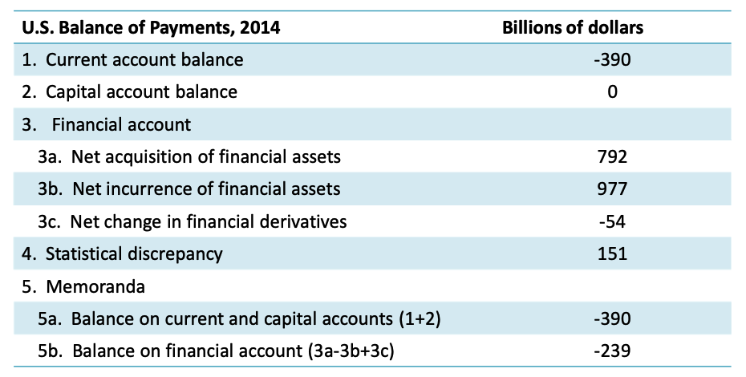

# Chapter 9 Trade and the Balance of Payments

## Learning Objectives

**9.1** Define the current, capital, and financial accounts of a country’s balance of payments. 

**9.2** Explain the importance of the three main components of the current account. 

**9.3** Describe three types of international capital flows. 

**9.4** Use a simple algebraic model to relate the current account to savings, investment and the general government budget balance. 

**9.5** Discuss the pros and cons of current account deficits. 

**9.6** Show the relationship between a country’s balance of payments and its international investment position.

## The Current Account

- There are three accounts within the balance of payments. 
  1. The **current account** primarily tracks the flow of goods and services between a country and the rest of the world world. 
  2. The **capital account** is the smallest of the three accounts and records transfers of specialized capital assets between countries. 
  3. The **financial account** is the record of all financial transactions between a country and the rest of the world. 

- The **current account balance** has three separate components: 
  1. The **trade balance** is the largest component and is the record of exports and imports of goods and is the record of exports and imports of goods and services; 
  2. Income received from abroad minus income paid abroad, called **primary income**; 
  3. Transfers made abroad minus transfers received from abroad, called **secondary income**. 

|                    | Credit                                                       | Debit                                                        |
| ------------------ | ------------------------------------------------------------ | ------------------------------------------------------------ |
| Goods and services | ==Exports==                                                  | ==Imports==                                                  |
| Primary income     | ==Investment income== received from foreigners, and compensation of employees at home received fromat home received from foreign firms. | ==Investment income== paid to foreigners, and compensation of foreign employees abroad paid by employees abroad paid by domestic firms. |
| Secondary income   | Transfers received from abroad                               | Transfers paid abroad.                                       |

- The three components of the current account. 
- The difference between exports and imports is the trade balance. 
- The difference between credits and debits is the current account balance.

- **Primary income** has two components: 
  1. ==Investment earnings== received (credit) and paid (debit); 
  1. ==Wages and salaries== received from abroad (credit) or paid abroad (debit). 
- **Secondary income** is often expressed on a net income basis: transfers received minus transfers paid. 
  - A key item in this category is **remittances**`汇兑额`, the part of wages or other income that individuals transfer to families and friends living outside the country. 
  - Countries with many immigrant workers send more remittances abroad; countries with many emigrants receive more remittances from abroad. 

## Capital Account

The capital account of the balance of payments is the record of specialized ==capital transfers==. Because it is a measure of ==transfers and not purchases or sales==, it is somewhat ==similar to the category of secondary income== of the current account, but with the major distinction that it applies to ==capital transfers== and not income transfers. Normally, this is a small item and includes relatively infrequent activities such as the transfer of military bases or embassies between countries, debt forgiveness, and the personal assets that migrants carry with them when they cross borders. `无条件的资本（固定资产、无形资产、商誉等）转移`

## The Financial Account

- The financial account is a record of ==financial flows== between countries. 
- Financial flows represent the purchase of foreign assets by home country residents and the sale of home by country assets to foreign residents. 
- There are three main accounting categories and many types of financial assets. 
  - **Net acquisition of financial assets;** 
  - **Net incurrence of financial liabilities;** 
  - **Changes in financial derivatives.**

### Net acquisition of financial assets. 

- Purchases of foreign financial assets; 
- Includes items such as real estate, businesses, stocks, bonds, bank loans, monetary gold, foreign currencies; 
- A ==positive== net acquisition means a country is ==buying more== foreign assets ==than it sells==; 
- A form of lending to foreigners. 

### Net incurrence of liabilities. 

- Foreign purchase of home country assets; 
- The same items as above;
- A ==positive== net incurrence of liabilities means that ==foreigners are buying more== home country assets ==than they are selling==; 
- A form of borrowing from abroad. 

### Summary

- A positive net acquisition of financial assets is a credit. 
- A positive net incurrence of liabilities is a debit. 
- The **statistical discrepancy**`差异` is the measurement ==error in the accounts==. 
  - In theory, the current account plus capital account equal the financial account balance but with opposite sign. 
  - In practice, there are measurement errors; the statistical discrepancy equals the financial account balance minus the current plus capital account balances. 
- If a country has a current account deficit, it must be financed. 
  - The deficit implies that the country consumes more than it produces. 
  - The financial account shows the type of assets sold to foreign residents by the deficit country foreign residents by the deficit country.
- If a country has a current account surplus, it has savings it can invest abroad. 
  - The surplus implies that the country produces more than it consumes.  
  - The financial account shows the types of assets it acquires. 
- The main categories of assets in the financial account are: 
  - **Foreign direct investment (FDI):** Investment in real assets (not paper assets) such as businesses, real estate, factories. 
  - **Portfolio investment:**  Investment in stocks and bonds and other paper assets. 
  - Other assets which take a variety of forms, but are mainly bank loans. 
- Lending money in a foreign country can be in the form of opening a bank account (loan to the bank), or through other intermediaries buying debt).
- Some types of asset flows are more volatile than others. 
  - Volatility: how easy or hard it is for the flow to reverse. 
  - Volatile inflows can increase risk: It is easier for them to become outflows. This puts a variety of pressures on the country experiencing sudden, large outflows, or a **sudden stop** in capital inflows. 
- FDI is considered the least volatile of financial flows. 
  - Assets are businesses, real estate, factories, and it is takes time to sell them and convert to a liquid asset that can be moved easily. 
  - Also, they represent a commitment on the part of the investor. 
- Reserve assets are monetary gold and foreign currency that can be used to settle international payments. 
  - All countries hold reserves as an emergency fund for making payments. 
  - Reserve assets cannot create liabilities, hence they are not Reserve assets cannot create liabilities, hence they are not symmetrical like the other assets. 
- Financial derivatives are a special class of assets that have a value derived from another asset. 
  - Example: A firm buys an option to buy dollars in the future at a set price.

### **The Limits on **Financial Flows

- During the Bretton Woods era, from 1945 to 1973, countries limited capital flows that were solely to purchase or sell financial assets. 
  - The IMF encouraged countries to allow capital flows t fi th t t to finance the current account. 
- After the break up of Bretton Woods, countries gradually began to allow freer capital movements. This trend gained speed in the 1980s and 1990s. 
- Economists were divided on the issue of allowing completely free movement of financial capital. 
  - Pros: It supplements domestic savings and brings capital for investment; it should add to growth. 
  - Cons: Financial flows are not goods so trade theory does not apply; they add to volatility and increase the risk of not apply; they add to volatility and increase the risk of financial crises. 
- The recent financial crisis (2007‐2009) and the Asian Crisis (1997‐1998) have caused there to be more caution and less support for the idea of completely open capital markets. 

## National Income and Product Accounts

- The **national income and produce accounts** (NIPA) are used to ==track domestic income and production==. 
- The central concept is **gross domestic product (GDP)**:  

  - The market value of all final goods and services produced inside a country’s borders over a period of time, usually one year. 
- **Gross national product (GNP)** is the market value of all final goods and services produced by the country’s labor, capital, and resources, during a year. 
- GNP and GDP are closely related: 
  - GNP = GDP + income received from abroad ‐ income paid to foreigners + transfers received from abroad ‐ transfers made abroad; 
- Alternatively, using the concepts in the current account: 

  - GNP = GDP + net primary income + net secondary income. 

## The Current Account and the Macroeconomy

Since

- GNP = GDP + net primary income + net secondary income; or 
- GNP = C + I + G + X – M + net primary income + net secondary income; or 
- GNP = C + I + G + CA.

We can also define: GNP = C + S + T; 

- This looks at GNP from the perspective of income recipients: They can consume, save, and pay taxes. 

Setting the two definitions of GNP equal to each other: 

- C + I + G + CA = C + S + T; or 
- S + (T – G) = I + CA. 

The accounting identity ==S`居民储蓄` + (T – G)`政府储蓄` = I`本国投资` + CA`外国资本净流入`==, says: 

- ==Private savings + public savings = domestic investment + foreign investment.== 

This shows the relationship between: 

- Budget deficits and trade (current account) deficits
- Overall savings and investment in an open economy that trades;
- Foreign and domestic investment; 
- Private and public savings. 

The relationship S + (T - G) = I + CA lets us infer several points: 
- Countries with large budget deficits (T - G < 0) or low savings rates will have less investment, ceteris paribus. 
- A current account deficit lets us invest more and/or run budget deficits. 
- Countries that try to **eliminate a current account deficit** have to ==cut investment==, or ==cut consumption== (raise S), or ==raise taxes==, or ==cut governmentspending==, or some combination. All of those reduce demand and push towards slower growth, ceteris paribus. 
- Private savings has several jobs: finance the budget deficit, if there is one, and provide fundsfor investment at home and abroad. 

During the financial crisis: 
- Savings increased as consumers and businesses worried about their solvency; 
- Investment declined as businesses cut back due to weak demand for their goods and services; 
- Budget deficits soared as tax revenue fell and expenditures increased; 
- The current account moved towards balance as consumers and businesses bought less from abroad. 

## Are Current Account Deficits harmful?

- Current account deficits can be harmful:
  - If a country is dependent on volatile foreign capital inflows to finance them;
  - If there is a **sudden stop** in foreign financing that forces large cuts in spending and consumption.
  - If they undermine confidence in the country and its currency.
  - If countries incur liabilities that must be paid back in a foreign currency.
- But they can sometimes be a sign of economic strength: 
  - If they are caused by large inflows of foreign capital, looking for a place to invest; 
  - If they are caused by a rise in imports when an economy experiences rapid economic growth. 
- There is no exact threshold for when a deficit becomes dangerous, but for most countries, when they reach 3‐5% of GDP, it is in the danger zone. 

## International Debt

- Net capital inflows are an increase in liabilities to foreign nations.  
  - The inflows can take several forms: FDI, portfolio investment, bank loans and others. 
  - Some forms represent an increase in debt by the home country to foreigners. 
    - **External debt** creates **debt service** obligations. 
- The burden of external debt depends on a number of factors. 
  - Its size relative to GDP; 
  - Whether denominated in home or foreign country currency; 
  - The size of the current account deficit and the need for continued capital inflows. 
- Debt can become unsustainable when: 
  - Debt service increases faster than GDP;  
  - Debt is denominated in a foreign currency and the borrowing country has a significant decline in the value of its own currency; 
  - A borrowing country depends on exports of 1 or 2 commodities that g y p p have falling prices in the world market. 
- The Highly Indebted Poor Countries (HIPC) is a World Bank program to offer debt relief to the most indebted, poorest countries. 

## **The International **Investment Position

- **International investment position**: Value of ==foreign assets== owned ==by home country== ==minus== the value of ==domestic assets== owned ==by foreigners==. 
- International investment position of the U.S.: Domestically owned foreign assets 
  - foreign owned domestic assets = \$24,595 billion ‐ \$31,615 billion = ‐7,020 billion 
- Current account surpluses add positive balances to the International investment position; deficits subtract. 
  - The large deficit in the U.S.’ international investment position is the consequence of large current account deficits in the 1980s, 1990s, 2000s. 
- Deficits`赤字` in the current account enable countries to invest more, and can lead to **technology transfers,** among other benefits. 
  - Technology transfer is usually embodied in FDI and can be very helpful to developing countries that are inside the frontier of technology and management.
