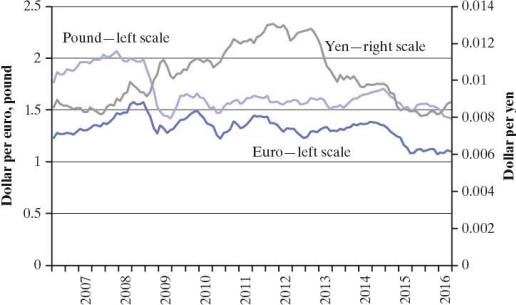
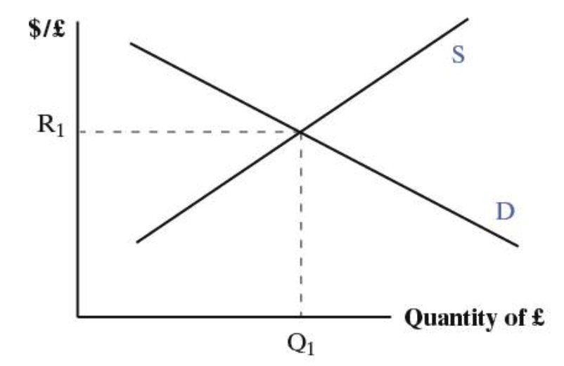
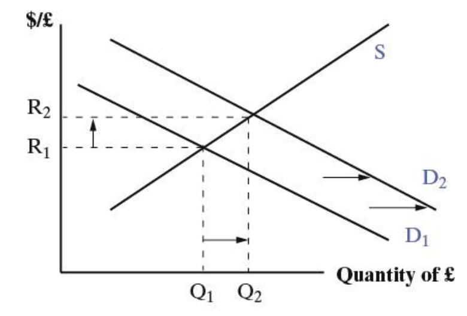
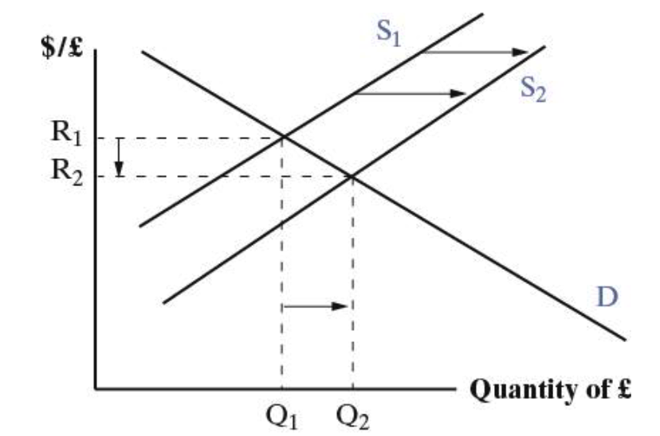
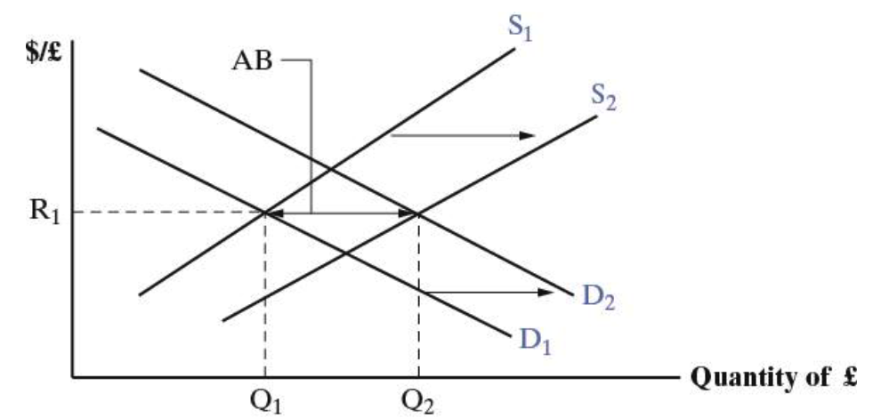

# **Chapter 10** Exchange Rates and Exchange Rate Systems

## Learning Objectives

**10.1** List the reasons for holding foreign exchange and the main institutions in the foreign exchange market. 

**10.2** Diagram the effects on the home currency of a change in the supply or demand for foreign currency. 

**10.3** Differentiate short-run, medium-run, and long-run forces that help determine the value of a currency.

**10.4** Calculate a currency’s forward premium or discount based on interest rate differentials. 

**10.5** Explain in words and with an equation the relationship between price changes and the real exchange rates. 

**10.6** State the necessary conditions for two or more countries to form a single currency area.

## Fixed, Flexible, or In-between?

- Every country must choose an exchange rate system to determine how prices in the home country currency are converted into prices in another country’s currency. 
- Countries have numerous choices among exchange rate systems on a continuum from fixed to completely flexible systems. 
- Each exchange rate system requires that governments and central banks have credible policies to support the system they select.

## Exchange Rates and Currency Trading

- **Exchange rate**: The price of a currency stated in terms of a second currency 
  - U.S. dollars per Mexican peso = 0.05 dollars per peso, or 
  - Mexican pesos per U.S. dollar = 20 pesos per dollar. 
  - Exchange rates are reported in every newspaper with a business section and on numerous web sites. 
  
- In general, exchange rates are either Units of domestic currency/unit of foreign currency, or Units of foreign currency/unit of domestic currency, 

- In the newspaper and elsewhere, the ratio is usually whichever one is above 1; so its pesos per dollar and dollars per euro. 

- For consistency, we will define the exchange rate as domestic over foreign, so its dollars per peso and dollars per euro.

- **Appreciation**: A currency becomes ==more valuable==; foreign currency costs less. 

- **Depreciation**: A the currency becomes ==less valuable==; foreign currency costs more.

- The most frequently used currencies in world trade and finance are: 
  - U.S. dollar; 
  - EU euro; 
  - Japanese yen; 
  - British pound. 
  
- All three are **flexible exchange rate systems**; 
  - Their value changes day to day, even minute to minute. 
  
- A majority of the world’s countries have **fixed exchange rate systems;** 
  - The value of their currency is fixed to the dollar, the euro, the pound, or another currency, or even a basket of currencies, and does not move in value.
  
  ****
  
- Exchange rates are scales, like miles and kilometres, or degrees Fahrenheit and Celsius. 
  
  - They do not tell us which currency is weak and which is strong by their value alone. 
  - To know relative strengths, we have to look at changes over time.

## **Reasons for Holding Foreign** Currencies

1. Trade and investment: Traders (importers and exporters), investors, and travellers routinely transact  in foreign currencies. 
2. Interest rate arbitrage` 套利`: Financial arbitrageurs will  take advantage of interest rate differentials between  countries; they borrow money where interest rates  are low and lend it where interest rates are high. 
3. Speculation: Speculators buy and sell currency in  anticipation of changes in the currency’s value;  speculators sell overvalued currencies and buy  undervalued ones.

## **Participants in Markets for** Foreign Exchange

- **Retail customers**: Firms and individuals hold foreign currency to  buy goods and services, to travel, to adjust their portfolios, and to  speculate. 
- **Commercial banks** hold currencies as part of their services for their  customers; they are the *largest* participant in currency markets. 
- **Foreign exchange brokers** are middlemen between banks and  buyers and sellers of foreign exchange. 
- **Central banks** hold foreign exchange as reserves and to supply  domestic banks that need it.

## Exchange Rate Risk

- Businesses operating in multiple countries encounter **exchange rate risk** due to the possibility of currency fluctuations. 
- Future payments or receipts in a foreign currency may be worth something different from expectations when the contract was signed. 
- Business people protect their interests by purchasing a contract to ==buy or sell the foreign currency in the future at a price agreed today==.

- **Forward exchange rate:** The price of a currency that will be delivered in the future.
- **Forward market:** The market for the buying and selling of currencies for future delivery. 
  - Businesses needing foreign currency or receiving foreign currency payments can sign a contract that guarantees a set price either 30, 60, 90, or 180 days in the future.
- **Spot market:** The market for the buying and selling of currencies in the present.

- When investors and speculators use the forward market to protect against unanticipated currency fluctuations, they are **hedging.** `套期`
  - They can buy a forward contract to sell foreign currency at the same time that their foreign assets will be sold. 
- Investors and speculators engage in **interest rate arbitrage** when they borrow in markets with low interest rates and lend in markets with high ones. 
  - When they hedge against currency fluctuations, they are engaging in **covered interest arbitrage.**

## Foreign Exchange Supply and Demand

- Supply and demand analysis is useful for analyzing exchange rates. 
  - Increases in supply lower the price. 
  - Increases in demand raise the price. 
- Price changes for foreign currency assumes there is a flexible exchange rate system; if there is a fixed exchange rate system, then changes in supply and demand must be offset by the monetary authority. 
  - Usually the central bank or the finance ministry.

- The graph of supply and demand has price on the vertical axis, quantity on the horizontal. 
  - Price is the exchange rate: units of domestic currency per unit of foreign. 
  - Quantity is the quantity of foreign exchange. 
- Demand slopes down to the right: as foreign exchange is cheaper, more is demanded, all else equal. 
- Supply slopes up to right: as foreign exchange is more expensive (domestic currency cheaper), foreigners are willing to supply more.

- The previous graphs assume a flexible exchange rate. 
- Demand changes are related to anything that might cause an increase in the demand for British pounds by U.S. residentds. 
  - Trading, travel, investing, speculating. 
- Supply changes are related to anything that might cause an increase in the supply of British pounds to the U.S. 
  - Trading, travel, investing, speculating.

## Exchange Rate Determination

- Exchange rates are exceedingly difficult to predict. One reason is that there are many factors that vary over the long run, medium run, and short run. 
- Four factors: 
  - **Long run**: **Purchasing power parity**. 
  - **Medium run**: Business cycle. 
  - **Short run**: **Interest parity** and speculation.

### Long run: Purchasing power parity

- **Purchasing power parity**: The exchange rate allows the ==same quantity of goods== to be bought ==in either currency== when converted from one to another. 
- PPP exchange rate depends on goods arbitrage, which works slowly, if at all.

>For example, that the dollar is overvalued and that instead of \$2 per pound, the exchange rate is \$1.75 per pound. 
>| Hypothetical example | Price of the same basket of goods |
>| -------------------- | --------------------------------- |
>| Dollars (U.S.)       | $1,000                            |
>| Pounds (U.K.)        | £500                              |
>| PPP Exchange rate    | $2/£                              |
>Prices are assumed to be the same as those shown in Table 10.1. 
>
>- In this case, \$1,000 buys ￡571.43 (\$1,000/\$1.75 per pound). 
>
>If merchants take the ￡571.43 and buy British goods and then ship the goods to the United States, they can earn more than \$1,000. (They earn \$1,142.86 since goods prices are 2 to 1.) 
>
>- In the long run, the demand for British pounds increases and, the exchange rate rises. 
>- The process will continue until the exchange rate hits \$2 per pound and there are no more profit-making opportunities from shipping goods from Britain to the United States.

- The story of ==goods arbitrage==—buying where the goods are cheaper and selling where they are more expensive—which stands behind purchasing power parity 
- In particular, it requires that goods flow costlessly across international borders and that all goods and services can be trade

  - In reality, there are transportation costs involved with moving goods and some goods and services are not traded.

- The merchant may face a tariff, import license fees, inspection fees, or some other barrier at the border that adds to his or her cost. 
- In addition, some goods and many services are not traded. For example, restaurant meals, haircuts, landscape maintenance, and a host of other services that must be consumed on the spot are rarely, if ever, traded.
- ==purchasing power parity== remains a significant ==long-run force== in the determination of exchange rates.

### Medium run force: The business cycle
- Consider impacts via exports and imports. 
  - Faster growth at home means more imports, more demand for foreign currency. All else equal, the home currency depreciates as demand for foreign currency shifts right. 
  - Faster growth abroad means more home country exports, more supply of foreign currency. All else equal, the home country currency appreciates as the supply of foreign currency shifts right.

### Short run: Interest parity and speculation.

- Short run forces: **Interest parity** condition and speculation. 
  - Interest parity holds that exchange rate movements should be sufficient to counteract any differences in interest rates between countries. 
  - Speculation is the buying and selling of assets in anticipation of a change in value. 
- The interest parity condition can be estimated from today’s interest rates and the exchange rate in the spot and forward markets.

- Interest rate arbitrageurs take advantage of interest rate differences in different countries. 
  - They borrow in the low interest rate market and lend in the high interest rate market. 
  
- Let: 

  - $i$ = home interest rate, 
  - $i^*$ = foreign interest rate; and 
  - $i>i^*$. 

The problem for the investor is that changes in the exchange rate will affect their overall rate of return.

Assume, an interest rate arbitrageur in the U.S. can earn i at home or $i^*$ in the U.K. 
- If they invest $\$1$, after one year, they have $\$(1+i)$ at home. 

- If they invest abroad, they change dollars for pounds and receive 100/R. After a year, it becomes: 
  
  $$
  £(1/R)(1+i^*)
  $$
  which has to be changed back into dollars. 

- An interest rate arbitrageur who knows how many pounds they will have in the future could sign a forward contract to sell the pounds for dollars: 
  $$
  (1/R)(1+i^*)F
  $$

- The equilibrium exchange rate is the one that equalizes returns in the U.S. and U.K.: 
  $$
  (1+i) = (1/R)(1+i^*)F = (F/R)(1+i^*)
  $$

- Divide both sides by $(1+i^*):$
  $$
  (1+i)/(1+i^*) = F/R
  $$

- Algebraically, this equation can be rearranged: 
  $$
  i - i^* \approx (F - R)/R
  $$

- The relationship is approximate, for low values of $i^*$.

The equation $i - i^* ≈ (F - R)/R$ has the interest rate differential on the left and the expected change in the exchange rate on the right. 
  - If $(F - R)/R > 0$, the home country currency is expected to depreciate, and $i > i^*$ . 
  - If $(F - R)/R < 0$, the home country currency is expected to appreciate, and $i < i^*$. 
  - The percentage appreciation or depreciation is expected to be equal to the interest rate differential; investors are indifferent between home and abroad.

|                                    | R rises: Appreciation in home  currency        | R falls: Depreciation in home  currency        |
| ---------------------------------- | ---------------------------------------------- | ---------------------------------------------- |
| Long run: Purchasing power  parity | Home goods are  less expensive than foreign    | Home goods are more   expensive than foreign   |
| Medium run: The  business cycle    | Domestic economy grows slower than foreign     | Domestic economy grows faster than foreign     |
| Short run (1): Interest   parity   | Interest rates rise at home and/or fall abroad | Interest rates fall at home and/or rise abroad |
| Short run (2):  Speculation        | Expectations of future appreciation            | Expectations of future depreciation            |

### Case Study: The Largest Market in the World

| Currency          | Percent of trades | Currency        | Percent of trades |
| ----------------- | ----------------- | --------------- | ----------------- |
| U.S.  dollar      | 87.0              | Swiss franc     | 5.2               |
| EU euro           | 33.4              | Canadian dollar | 4.6               |
| Japanese yen      | 23.0              | Mexican peso    | 2.5               |
| U.K. pound        | 11.8              | Chinese yuan    | 2.2               |
| Australian dollar | 8.6               | Other           | 21.7              |

- Trading foreign currency is the largest market in the world: In 2013 it was worth $5,345 billion per day. 
- The U.S. dollar is involved in 87 percent of all trades. 
- The numbers add to 200 percent because every transaction involves 2 currencies.

| Location        | Percent of trades | Location    | Percent of trades |
| --------------- | ----------------- | ----------- | ----------------- |
| United  Kingdom | 40.9              | Switzerland | 3.2               |
| United States   | 18.9              | France      | 2.8               |
| Singapore       | 5.7               | Australia   | 2.7               |
| Japan           | 5.6               | Other       | 16.1              |
| Hong Kong       | 4.1               |             |                   |

- Nearly 60 percent of all trades occur in the United Kingdom (London) or the United States (New York). 
- The U.K. market is more than twice the size of the U.S. market. 
- China is not yet a major player, although Hong Kong is.

## The Real Exchange Rate

- The market exchange rate, or **nominal exchange rate** is the price of a unit of foreign currency. 
  - It does not tell the value of the goods and services that can be purchased. 
  - The value of the goods and services depends on foreign prices. 
- The **real exchange rate** is the nominal rate ==adjusted for price== differences at home and abroad.

- Define the following: 
  - $R_r$ = the real exchange rate; 
  - $R_n$ = the nominal exchange rate; 
  - $P^*$ = foreign price level 
  - $P$ = domestic price level. 
  
- The real exchange rate: 
  $$
  Rr = Rn(P^*/P)
  $$

- The real exchange rate shows whether a currency is ==depreciating or appreciating== in ==its purchasing power== over foreign goods and services. 
  - Nominal appreciation or depreciation is not always the same as real. 
  - Businesses and households that use foreign exchange are more concerned about the real value of their currency than the nominal.

- Assume the following values: 
  - The dollar/euro exchange rate = \$1.10 per euro. 
  - Base year price index in both countries = 100. 

- The real exchange rate in the base year: 
  - \$1.10(100/100) = \$1.10 = the nominal rate. 

- Next year: Assume inflation is 10% in U.S. and 0 in EU and nominal rate is unchanged. 

  The real exchange rate: 
  - \$1.10(100/110) = \$1. 
  - US dollar has appreciated in real terms: The nominal rate has not changed, but in comparison to the base year, dollars buy more in Europe relative to what they buy in the U.S.

## Alternatives to Flexible Exchange Rates

- ==**Flexible exchange rate systems**== let the home currency change in value relative to other currencies. 
  - The exchange rate is a price, prices can change over time. 
  - Flexible or floating rates have varying degrees of flexibility; some governments intervene occasionally, others very infrequently, to control the movement. 
- ==**Fixed exchange rates**==, also called **pegged`盯住` exchange rates** come in a variety of formats. 
  - **Hard pegs** are not allowed to change in value at all. 
  - **Soft pegs** are allowed to change within some limit, but not beyond that limit.

| Exchange rate system,  2014 | Countries |
| --------------------------- | --------- |
| Hard pegs                   | 25        |
| Soft pegs                   | 101       |
| Managed floating            | 36        |
| Independently floating      | 29        |
| Total                       | 191       |

- Most countries have some form of a fixed exchange rate system. 
- Managed float implies some level of government intervention to control the currency, but much less than with a pegged system.

### Fixed Exchange Rate Systems
- A **gold standard** is one type of fixed exchange rate: the value of currency is set to a quantity of gold. 

  - Rules of the gold standard: 
    - Fix the currency to a given quantity of gold; e.g., $35 per ounce; 
    - Keep a fixed ratio of domestic money to gold; 
    - Be willing and able to convert domestic money to gold, and vice versa. 

  - Under the gold standard: 
    - The money supply is determined by the quantity of gold; 
    - Countries cannot use monetary policy; the money supply is fixed to the quantity of gold. 
    - Central banks or monetary authorities must be willing and able to supply gold when the demand increases.

- Under the **Bretton Woods exchange rate system** (1947-1973) nearly all countries had fixed exchange rates. 
  - The U.S. dollar was fixed to gold; 
  - Other countries were fixed to the U.S. dollar.

- **==Fixed exchange rates==** are similar to gold standards but instead of pegging the home currency to gold, it is pegged to another currency or to a basket of currencies. 

  The monetary authority must be willing and able to convert the national currency into the currency it pegs to, at the official rate of exchange. 

  - This limits the ability to use monetary policy since the money supply must not grow beyond the point where it can be converted.

- Consider the case of a ==sudden increase in demand for foreign exchange== in a country with a ==fixed exchange rate== system. 
  - Normally, a rightward shift of the demand curve leads to a depreciation of the home currency. 
  - However, the monetary authority cannot let that happen, so they must counter the demand shift with a supply shift. 
    - The supply shift must be large enough to keep the exchange rate constant. 
    - The monetary authority must have enough foreign exchange on hand to be able to supply the increase demand.

- Fixed exchange rates come in various ==forms==: 
  - Some countries adopt a foreign currency as their own. 
  - Some peg to a foreign currency and keep it fixed. 
  - Some peg to a basket of foreign currencies. 
  - Some peg to a foreign currency and adjust it periodically. This is called a **crawling peg.** 
  - Some peg to another currency, but let it float up or down by some percentage before they intervene.

#### Case Study: The End of the Bretton Woods Exchange Rate System

- The Bretton Woods exchange rate system was created at the Bretton Woods Conference in 1944, along with the IMF and World Bank. 
- The goal was to create a money supply that could be used to make international payments. 
  - The U.S. dollar was selected as the reserve currency for the countries that participated. 
  - The dollar was tied to gold at $35 per ounce and other counties tied their currencies to the dollar. 
  - The U.S. was required to exchange its dollars for gold whenever other countries asked.
- The system worked relatively well until the late 1960s. 
  - The world payments system had adequate liquidity; 
  - As the 1960s progressed, too many U.S. dollars accumulated in Europe and elsewhere. 
  - In 1971, the **Smithsonian Agreement** allowed the U.S. to devalue by changing the gold value of the dollar from \$35 per ounce to $38.02. 
  - In the same year, President Nixon announced that the dollar would no longer be exchanged for gold. 
- In 1973, there was another devaluation, countries began to let their currencies float against each other, and the Bretton Woods exchange rate system was dead.

### Choosing the Right Exchange Rate System

- Fixed rates **provide**: 
  - Greater ==certainty== about the future exchange rate; 
  - A more ==certain environment== for business planning. 
- Fixed rates **do not**: 
  - ==Protect against outside shocks==, such as a sudden drop in commodity prices; 
  - Let countries have an ==independent monetary policy==; all monetary policy must support the currency, not the domestic economy. 
- Fixed rates **require**: 
  - ==Caution in the creation of new money==; 
  - A high level of ==credibility==; the rate must be perceived as stable and correct in value.

- **Flexible** rates **provide**: 
  - ==Insulation from shocks== that originate outside the economy, such as a sudden fall in commodity prices or a decline in foreign demand for domestic output; 
  - The conditions for an ==independent== monetary policy, which gives greater ==flexibility== in addressing domestic concerns about economic growth, unemployment.

## Single Currency Areas

- A single currency area, also called an **optimal currency area**, is ==a region that adopts a single currency==. 
  - Best example: The euro. 
- There are three conditions that must be met in order for a single currency to be better than multiple currencies: 
  - Business cycles must be synchronized; 
  - Labor and capital must be mobile between countries; 
  - There must be policies for addressing regional differences in growth when the business cycles do not match.

- The benefits of a single currency are: 
  1. ==Reduced transaction costs in currency== conversions and accounting. Data on increased trade and investment is mixed. 
  2. ==Eliminates price fluctuations== caused by changes in the exchange rate 
  3. Help ==increase political trust== between countries seeking to increase their integration.

- The largest potential cost of a single currency is that countries sharing a currency ==give up their independent monetary policies==. 

  Consequently, some analysts argue that there must be a fiscal union of some kind that can transfer resources from regions doing well to regions not doing well. This requires that the goal is more than simply increased trade and investment.

