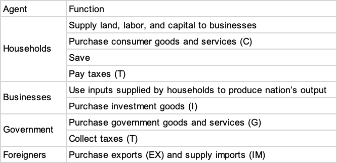
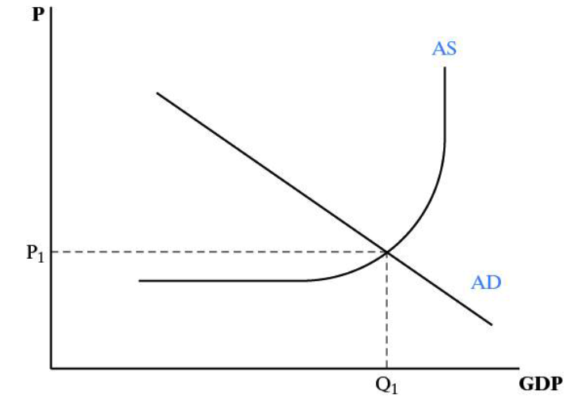
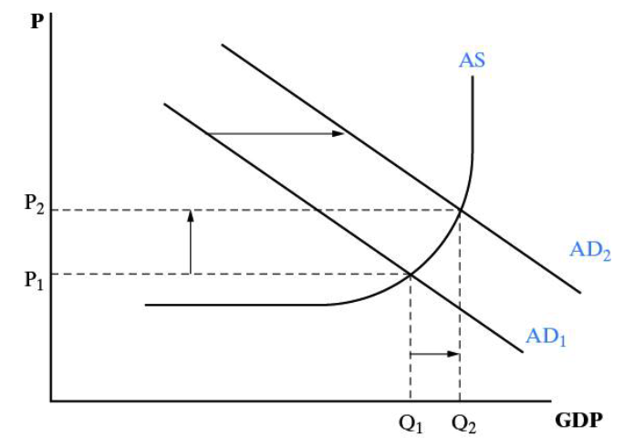
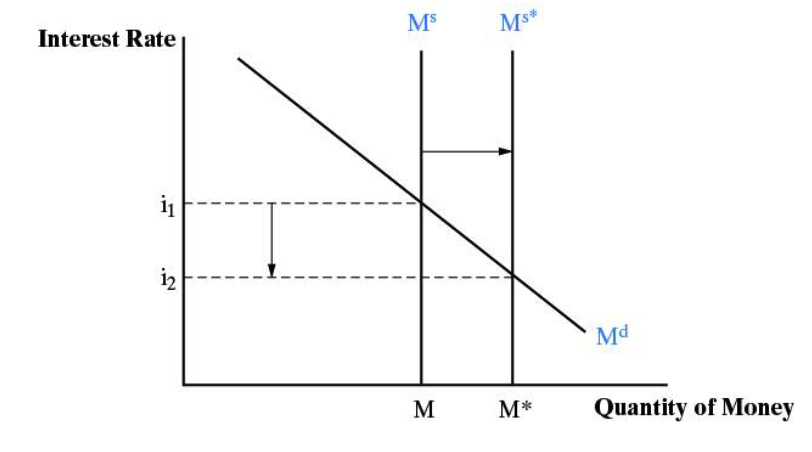
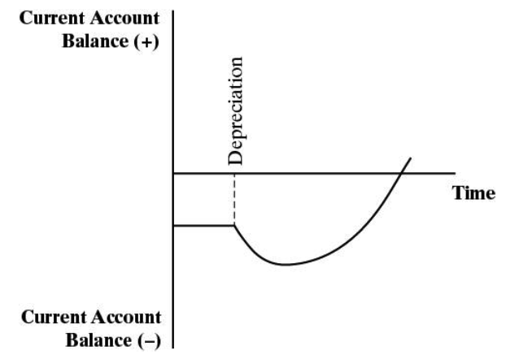

# Chapter 11 An Introduction to Open Economy Macroeconomics

## Learning Objectives

11.1 Diagram a shift in aggregate demand or supply and explain the impact on the price level. 

11.2 Diagram the effects of GDP and the price level of expansionary and contractionary fiscal and monetary policies. 

11.3 Analyze the effects of fiscal and monetary policies on the current account and the exchange rate.

11.4 Explain how expenditure switching and expenditure reducing policies can be used to reduce a current account deficit. 

11.5 Draw a J-curve and use it to show how exchange rate depreciation does not lead to an immediate reduction in the current account deficit. 

## Aggregate Demand and Supply


- Since the Great Depression of the 1930s, national governments have held a central role in guaranteeing economic growth, employment, and price stability. 
- In the aggregate demand and supply model of this chapter, households, businesses, government and foreigners each play an important role.





- There are four main agents in the macroeconomy, each with a different role and each a different source of demand for goods and services. 
- **Aggregate supply (AS)** is the output of all final goods and services. 
  - The AS curve shows the output businesses would produce at different price 
- **Aggregate demand (AD)** is the sum of expenditures on final goods and services by households, businesses, government, and foreigners. 
  - The AD curve shows the amount purchased at different price levels.




As drawn, the **AS** curve has three regions: 
  - A horizontal region representing levels of output below full employment; 
  - An upward curving region representing an area nearer to full employment where inputs start to become scarcer and prices begin to rise with further increases in output. 
  - A vertical region representing full employment. No further output is possible given the levels of labor, capital, and resources, and attempts to increase Q only cause a rise in P.


- In the **short run** and **medium run**, many fluctuations in the economy are attributable to shifts in **aggregate demand**. 
- When consumers, businesses, governments, or foreigners change their demands for goods and services, the AD curve will shift.




- Figure 11.2 shows an increase in AD, and rises in prices and output. 

- The steeper the AS curve, the more of the increase in AD that is channeled into price increases; the flatter, more it is channeled into output increases. 

- When ==output increases==, ==incomes increase==; we can be fairly certain that some amount of the new, ==higher level of income== will be passed on as ==another round of increasing demand== and income. 

  ```mermaid
  graph LR; 
  A(1. Demand Increase)--> B(2. Price & Output Increase)
  B-->C(3. Income Increase)
  C-->A
  ```

  - This is called the **multiplier effect**`乘数效应`. 

- Economists disagree as to the **size of the multiplier**; in all likelihood it varies depending on a number of factors. 
  - How close or far from full employment; 
  - What part of the economy receives the initial increase in spending; 
  - How the increase in spending is paid for; 

- Each new round of spending-income-spending, etc., ==is decreased by== the propensity`习惯` of households to ==save== part of an increase in income, and because part is spent on imports. 
  - Hence, the multiplier effect ==eventually disappears==.

## Fiscal and Monetary Policies

### Fiscal policies


- **Fiscal policies** are policies of ==taxation and government spending==; 
  - **Expansionary** fiscal policy refers to an increase in government spending and/or a cut in taxes. Both increase overall spending in the economy. 
  - **Contractionary** fiscal policy, also called austerity, refers to a decrease in government spending and/or an increase in taxes. Both reduce overall spending in the economy. 
- **Problems** with fiscal policy: 
  - ==Inflationary== bias; 
  - ==Multipliers== are not well understood and the size is often ==estimated incorrectly==; 
  - Different methods of financing increases in government spending have different multipliers; 
  - Cumbersome`笨重的` to implement, with long and uncertain lags. 
- For these reasons and others, fiscal policies were not widely used from the 1980s on. 
- Nevertheless, when monetary policy fails, they may be the only tool left to manage a recession.

### Monetary policies


- **Monetary policies** are policies of ==interest rates and the money supply==; 
  - **Expansionary** monetary policy refers to a decrease in interest rates as a result of an increase in the money supply. 
  - **Contractionary** monetary policy refers to an increase in interest rates as a result of a decrease in the money supply.

- Monetary policy is more agile`灵活` than fiscal policy. 
  - Relies on changes in the money supply that affect interest rates. 
  - This is relatively easy to accomplish, compared to fiscal policy.

- The central bank uses ==open market operations== to alter the money supply. 
  - Selling bonds shrinks the money supply and rises interest rates. 
  - Buying them does the opposite.



### Case Study: Fiscal and Monetary Policy During the Great Depression


- The Great Depress is a worldwide depression; 
  - It was actually two recessions, one from 1929 to 1933 and the second from 1937-1938. 
  - Recovery from the first was not complete when the second began, so the whole decade is labeled as the Great Depression. 
- In the U.S., unemployment reached 25 percent and GDP fell by approximately 26 percent from 1929 to 1933.

- Governments did not view it as their responsibility to stabilize the economy; nor did they think they could. They believed that increases in government spending would replace, not supplement, private spending. 
- Governments were afraid to raise government spending too much for fear of increasing the size of the budget deficit. 
  - They believed that budget deficits undermined business confidence in government policy and would worsen the depression. 
  - No one understood fiscal policy as a tool for fighting recessions.

- Governments were also obligated to maintain the gold standard. 
  - They could not engage in expansionary monetary policy if it would lead to falling interest rates and gold outflows. 
- The UK left the gold standard in 1931 and began to recover. 
  - The U.S. left the gold standard in 1933 when the new president, Franklin Roosevelt, took office. 
  - Growth in 1934, 1935 and 1936 was rapid.

## Current Account Balances Revisited

- Two steps to describe this relationship: 
  - First step: Monetary and fiscal policy impacts on ==interest rates and exchange rates==. 
  - Second step: Bringing in the ==current account==.

- Recall the interest parity condition from Chapter 10: 
  $$
  i^* \approx (F - R)/R. 
  $$
  
  - If ==$i$ rises==, then foreign capital is attracted to the home country, the ==demand for its currency (F) increases== (supply of foreign exchange increases), and ==R will fall== (an appreciation). 
  - The effect of a fall in interest rates is symmetrical.
  

### Monetary policy effects

Monetary policy works through **==interest rate changes==**

- ==Contractionary== monetary policy will ==raise interest rates== and, all else equal, cause an appreciation of the home country currency in a flexible exchange rate system.
  - This is why countries are often encouraged to raise interest rates if their currency is depreciating rapidly. 
- Expansionary policy has the opposite effect: interest rates fall, the currency depreciates.

### Fiscal policy effects

Fiscal policy effects on the exchange rate work through the change in income, and ==**income’s effect**== on interest rates. 

- **Expansionary** fiscal policy ==raises incomes and spending==.
  
  - The rise in income ==leads to an increase in the demand for money== and an ==increase in interest rates== 
  
    If the money supply holds constant: The exchange rate appreciates. 
  
- The effects of contractionary fiscal policies are symmetrical. 

### Effect of change on exchange rate

- Exchange rate ==appreciation== causes imports to be cheaper, and makes domestic goods more expensive to foreigners: 
  - Imports increase, exports decrease, the ==current account== moves in the direction of ==deficit==. 

- Exchange rate ==depreciation== causes imports to be more expensive, and makes domestic goods less expensive to foreigners: 
  - Imports decrease, exports increase, the ==current account== moves in the direction of ==surplus==.

- Fiscal and monetary policies also have direct effects on the current account though their effects on income and spending. 
  - Growth in spending at home increases imports, all else equal. 

- Fiscal policy’s direct effect on the current account: 
  - The same as the effect via the interest rate and exchange rate channels. 

- Monetary policy’s direct effect on the current account: 
  - Opposite of the effect via the interest rate and exchange rate channels.

| Short Effect   | Monetary Contraction | Monetary Expansion | Fiscal  Contraction | Fiscal  Expansion |
| -------------- | :------------------: | :----------------: | :-----------------: | :---------------: |
| Y and C        |          ↓           |         ↑          |          ↓          |         ↑         |
| Interest rates |          ↑           |         ↑          |          ↓          |         ↑         |
| R              |          ↓           |         ↑          |          ↑          |         ↓         |
| CA             |       ↑  or  ↓       |      ↑  or  ↓      |          ↑          |         ↓         |

> Notice: CA = IMPORT - EXPORT
>
> R ↓ when home country current appreciates → Import increase, Export decrease → CA ↑


- An increase in R is a depreciation. 
- Monetary and fiscal policies have different effects on interest rates, exchange rates and the current account.


- **The long run**: The economy ==tends to fluctuate around a full employment level of output==. 
- Economists disagree as to how quickly an economy will return to full employment if it is recession, but all or nearly all agree that it will eventually get there. 
- Therefore, fiscal and monetary policies can alter the level of output and employment, but in the long run economies tend towards full employment. 
- Similarly, current accounts must eventually tend towards balance, although imbalances may persist for long periods of time.

## Macro Policies for Current Account Imbalances


- Macroeconomic policies for addressing a current account imbalance: 
  - ==**Expenditure switching policies**== to ==shift spending from foreign to home goods== and services. 
    - Monetary and fiscal policies that cause a currency depreciation;
    - Temporary trade barriers to reduce imports. 
  - ==**Expenditure reducing policies**== to offset the ==increase in spending on domestic== goods and services. 
    - Contractionary monetary and fiscal policies to cut demand.


### Adjustment process


- The adjustment process is the change in the current account balance that occurs in response to a change in the exchange rate. 
- Normally, the adjustment occurs with a lag`延迟`. 
  - The graph of the lag is called the **J-curve**. 
  - Importers cannot switch to domestic suppliers immediately and foreign goods are suddenly more expensive. 
- U.S. experience shows that it can take 1-2 years before the current account balance improves after a depreciation in the dollar.



## Macroeconomic Policy Coordination in Developed Countries


- Coordination of macroeconomic policies is a frequently sought goal, particularly when global growth is slow. 
  - A simultaneous increase in fiscal or monetary expansion could avoid a disproportionate burden falling on one country. 
  - If one country uses expansionary policies and the others do not, the expanding country is more likely to see a ballooning of its current account deficit. 
- There are several problems, however: 
  - There is no international organization to arrange this. 
  - It is rare that a large number of countries find it in their interests to pursue the same policies.

